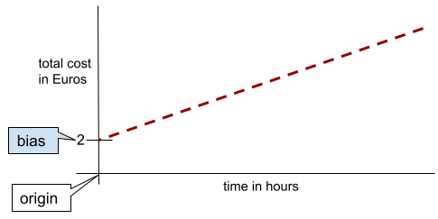
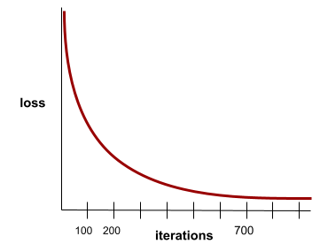
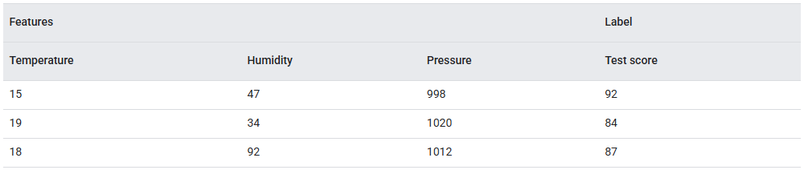

### Bias

An intercept or offset from an origin.

Bias is a parameter in machine learning models, which is symbolized by either of the following:

- $b$
- $w_0$

For example, bias is the $b$ in the following formula:

$$
y' = b + w_1x_1 + w_2x_2 + ... + w_nx_n
$$

In a simple two-dimensional line, bias just means "y-intercept."

:::tip[Example: Amusement Park]

The bias of the line in the following illustration is $2$.

Bias exists because *not all models start from the origin* $(0,0)$.

Suppose an amusement park costs $2$ Euros to enter and an additional $0.5$ Euro for every hour a customer stays. Therefore, a model mapping the total cost has a bias of $2$ because the lowest cost is $2$ Euros.

:::

### Convergence

A state reached when **[loss](#loss)** values change very little or not at all with each **iteration**. A model converges when additional training won't improve the model.

:::tip[Example]

For example, the following loss curve suggests convergence at around 700 iterations:

:::

In **[deep learning](#deep-learning)**, loss values sometimes stay constant or nearly so for many iterations before finally descending. During a long period of constant loss values, you may temporarily get a *false sense of convergence*.

### Deep Learning

Deep Learning is a specialized subset of **[machine learning](#machine-learning)** that uses **multi-layered neural networks** to automatically learn data representations and features at various levels of abstraction, often achieving state-of-the-art results in tasks like image recognition, natural language processing, and speech recognition.

Below is a concise table comparing Machine Learning (ML) and Deep Learning (DL):

| **Criterion**              | **Machine Learning (ML)**                                                                             | **Deep Learning (DL)**                                                                                                  |
|----------------------------|-------------------------------------------------------------------------------------------------------|-------------------------------------------------------------------------------------------------------------------------|
| *Model Architecture*       | Utilizes a wide variety of relatively shallow models (e.g., decision trees, linear regression, SVMs). | Primarily employs deep neural networks with multiple hidden layers for feature extraction and pattern recognition.      |
| *Feature Engineering*      | Often requires manual feature selection and engineering by domain experts.                            | Automates feature extraction via the layered structure of neural networks, learning features directly from raw data.    |
| *Data Requirements*        | Can work effectively with smaller datasets, provided that features are well-engineered.               | Generally requires large datasets to prevent overfitting and to leverage the network’s ability to learn complex tasks.  |
| *Computational Resources*  | Typically less computationally intensive; can be trained on standard CPUs.                            | Often demands powerful GPUs or specialized hardware (like TPUs) due to computationally heavy operations.                |
| *Performance & Complexity* | Effective for many structured problems; can be easier to interpret and faster to train.               | Excels at complex tasks (e.g., image recognition, NLP), often outperforming traditional ML when ample data is available.|
| *Interpretability*         | Models such as linear or tree-based methods are relatively more interpretable.                        | Networks are often seen as “black boxes,” and specialized methods are required to interpret their decisions.            |

### Feature

An input variable to a machine learning model. An **example** consists of one or more features.

:::tip[Example]

Suppose you are training a model to determine the influence of weather conditions on student test scores. The following table shows three examples, each of which contains three features and one label:

:::

### Gradient Descent

A mathematical technique to minimize **[loss](#loss)**. Gradient descent iteratively adjusts **[weights](#weight)** and **[biases](#bias)**, gradually finding the best combination to minimize loss.

*Note: gradient descent is older - much, much older - than machine learning.*

### Hyperparameter

The variables that you or a hyperparameter tuning service adjust during successive runs of training a model.

For example, **[learning rate](#learning-rate)** is a hyperparameter. You could set the learning rate to $0.01$ before one training session. If you determine that $0.01$ is too high, you could perhaps set the learning rate to $0.003$ for the next training session.

In contrast, parameters are the various **[weights](#weight)** and **[bias](#bias)** that the model learns during training.

### Inference

In machine learning, the process of making predictions by applying a trained model to **unlabeled examples**.

### Learning Rate

A floating-point number that tells the **[gradient descent](#gradient-descent)** algorithm how strongly to adjust weights and biases on each **iteration**.

For example, a learning rate of $0.3$ would adjust weights and biases three times more powerfully than a learning rate of $0.1$.

Learning rate is a key **[hyperparameter](#hyperparameter)**. If you set the learning rate too low, training will take too long. If you set the learning rate too high, gradient descent often has trouble reaching **[convergence](#convergence)**.

### Loss

During the **[training](#training)** of a **[supervised model](#supervised-machine-learning)**, a measure of how far a model's **prediction** is from its **label**.

A **[loss function](#loss-function)** calculates the loss.

### Loss Function

During **[training](#training)** or testing, a mathematical function that calculates the **[loss](#loss)** on a batch of examples. The goal of training is typically to minimize the loss that a loss function returns.

Many different kinds of loss functions exist. Pick the appropriate loss function for the kind of model you are building. For example:

- **L2 loss** (or **Mean Squared Error**) is the loss function for linear regression.
- **Log Loss** is the loss function for logistic regression.

### Machine Learning

Machine Learning is a branch of Artificial Intelligence that focuses on creating algorithms and models which enable computer systems to learn patterns from data and make predictions or decisions without being explicitly programmed for each task.

### Model

In general, any mathematical construct that processes input data and returns output.

Phrased differently, a model is the set of parameters and structure needed for a system to make predictions. In **[supervised machine learning](#supervised-machine-learning)**, a model takes an **example** as input and infers a prediction as output. Within supervised machine learning, models differ somewhat. For example:

- A **linear regression** model consists of a set of weights and a bias.
- A **neural network** model consists of:
  - A set of hidden layers, each containing one or more neurons.
  - The weights and bias associated with each neuron.
- A **decision tree** model consists of:
  - The shape of the tree; that is, the pattern in which the conditions and leaves are connected.
  - The conditions and leaves.

You can save, restore, or make copies of a model.

**[Unsupervised machine learning](#unsupervised-machine-learning)** also generates models, typically a function that can map an input example to the most appropriate **cluster**.

### Parameters

The **[weights](#weight)** and **[biases](#bias)** that a model learns during **[training](#training)**. For example, in a linear regression model, the parameters consist of the bias ($b$) and all the weights ($w1$, $w2$, and so on) in the following formula:

$$
y' = b + w_1x_1 + w_2x_2 + ... + w_nx_n
$$

In contrast, **[hyperparameters](#hyperparameter)** are the values that you (or a hyperparameter tuning service) supply to the model. For example, **[learning rate](#learning-rate)** is a hyperparameter.

### Supervised Machine Learning

Training a **[model](#model)** from **[features](#feature)** and their corresponding **labels**.

:::tip[Hint]

Supervised machine learning is analogous to learning a subject by studying a set of questions and their corresponding answers. After mastering the mapping between questions and answers, a student can then provide answers to new (never-before-seen) questions on the same topic.

:::

Compare with **[unsupervised machine learning](#unsupervised-machine-learning)**.

### Training

The process of determining the ideal **[parameters](#parameters)** (weights and biases) comprising a **[model](#model)**. During training, a system reads in **examples** and gradually adjusts parameters. Training uses each example anywhere from a few times to billions of times.

### Unsupervised Machine Learning

Training a **[model](#model)** to find patterns in a dataset, typically an unlabeled dataset.

The most common use of unsupervised machine learning is to **cluster** data into groups of similar examples.

:::tip[Example: Clustering]

For example, an unsupervised machine learning algorithm can cluster songs based on various properties of the music. The resulting clusters can become an input to other machine learning algorithms (for example, to a music recommendation service).

Clustering can help when useful labels are scarce or absent. For example, in domains such as anti-abuse and fraud, clusters can help humans better understand the data.

:::

Compare with **[supervised machine learning](#supervised-machine-learning)**.

### Weight

A value that a model multiplies by another value. **[Training](#training)** is the process of determining a model's ideal weights; **[inference](#inference)** is the process of using those learned weights to make predictions.

:::tip[Example: Linear Model]
Imagine a **linear model** with two features. Suppose that training determines the following weights (and **[bias](#bias)**):

- The bias, $b$, has a value of $2.2$.
- The weight, $w₁$, associated with one feature is $1.5$.
- The weight, $w₂$, associated with the other feature is $0.4$.

Now imagine an **example** with the following feature values:

- The value of one feature, $x₁$, is $6$.
- The value of the other feature, $x₂$, is $10$.

This linear model uses the following formula to generate a prediction, $y'$:

$$
y' = b + w_1 x_1 + w_2 x_2
$$

Therefore, the prediction is:

$$
y' = 2.2 + (1.5)(6) + (0.4)(10) = 15.2
$$

If a weight is $0$, then the corresponding feature doesn't contribute to the model.
For example, if $w₁$ is $0$, then the value of $x₁$ is irrelevant.
:::
