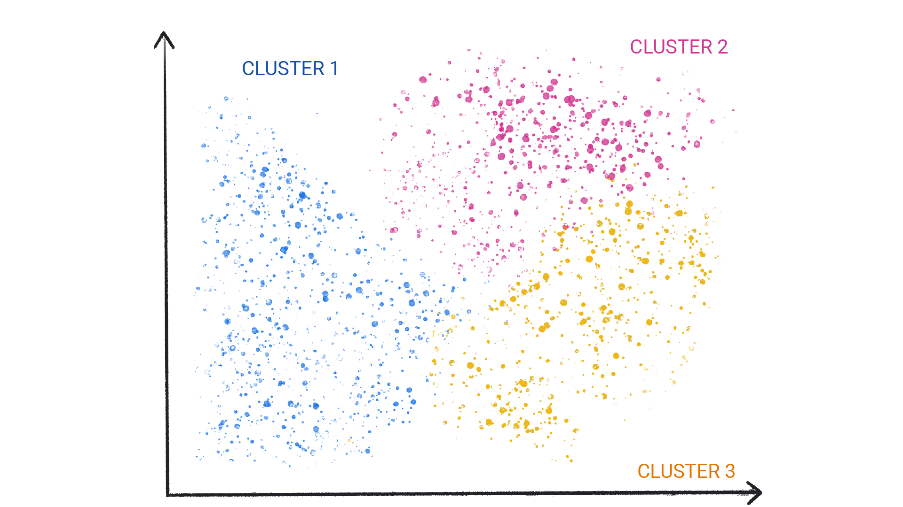

## ➡️ **Useful Materials**

### Original Source

You can find here the original course: [**What is Machine Learning?**](https://developers.google.com/machine-learning/intro-to-ml/what-is-ml)

## 1️⃣ **Introduction**

### Definition

Machine learning is a system that learns how to make predictions by analyzing large datasets to uncover **patterns** and **correlations**. Unlike traditional software, where programmers hard-code specific rules, a machine learning model **extracts** these rules from the data itself. This often results in more **accurate predictions** compared to manually written instructions.

:::info[Intuitive Definition]

In basic terms, Machine Learning is the process of **training** a piece of software, called a **model**, to make useful **predictions** or generate content from data.

:::

### Supervised Machine Learning

In supervised learning, the model receives labeled examples and gradually improves as it **processes more data**. Over time, it can detect relationships that may remain **invisible to human observers**. The key advantage lies in the model’s ability to **evolve continuously**, refining its predictions as it encounters new or changing information.

:::tip[Example: Rainfall Prediction]

1. **Traditional Approach**  
   A programmer would design a **complex program** that represents Earth’s surface and atmosphere through mathematical models. This process is **extremely challenging** because it must capture numerous intricate factors.

2. **Machine Learning Approach**  
   A machine learning system only needs **large amounts of weather data**. By analyzing this data, it discovers the conditions that correlate with rainfall. After enough training, it can make **reliable** rainfall predictions without explicit instructions on the underlying physics.

:::

### Applications

Machine learning is **widely used** in fields such as:

- **Climate Science**  
Weather forecasting and climate modeling  
- **Agriculture**  
Optimizing crop yields and resource usage  
- **Finance**  
Predicting stock performance and managing risk  
- **Manufacturing**  
Streamlining production and quality control  

It **adapts** to different problems, making it a valuable tool in a wide range of industries and domains.

### Types of ML Systems

ML systems fall into one or more of the following categories based on how they learn to make predictions or generate content:

- Supervised learning
- Unsupervised learning
- Reinforcement learning
- Generative AI

## 2️⃣ **Supervised Learning**

Supervised learning models can make predictions by first **observing large datasets** with the **correct answers** provided. These models then **discover the connections** between elements in the data that produce those correct answers.

It’s similar to how a student learns by studying old exams that contain both questions and answers. After training on enough old exams, the student becomes well-prepared to tackle new questions. In the same way, supervised learning systems are **“supervised”** because a human supplies the models with data that includes **known correct results**.

### Common Use Cases

- **Regression**  
Predicting continuous values (e.g., forecasting temperatures or housing prices)  
- **Classification**  
Assigning labels to items (e.g., determining whether an email is spam or not)

### Regression

A regression model predicts a numeric value. For example, a weather model that forecasts the amount of rain (in inches or millimeters) is considered a regression model.

Here are some other examples:

| Scenario             | Possible Input Data                                                                                                                                 | Numeric Prediction                                             |
|----------------------|------------------------------------------------------------------------------------------------------------------------------------------------------|----------------------------------------------------------------|
| Future house price   | Square footage, zip code, number of bedrooms/bathrooms, lot size, mortgage interest rate, property tax rate, construction costs, number of homes for sale in the area | The price of the home                                          |
| Future ride time     | Historical traffic conditions (from smartphones, traffic sensors, ride-hailing and navigation apps), distance to destination, weather conditions                                               | The time (minutes/seconds) to arrive at the destination        |

### Classification

Classification models predict the likelihood that something belongs to a specific category. Unlike regression models, whose output is a number, classification models produce a categorical output that indicates whether (or which) category applies. For example, these models can predict whether an email is spam or whether a photo contains a cat.

Classification models typically fall into two groups:

- **Binary classification**  
Outputs from a class containing only two values (for example, “rain” or “no rain”).
- **Multiclass classification**  
Outputs from a class with more than two possible values (for example, “rain,” “hail,” “snow,” or “sleet”).

## 3️⃣ **Unsupervised Learning**

Unsupervised learning models make predictions with **data that does not include any correct answers**. The primary goal is to **identify meaningful patterns** in the data. In other words, the model has **no hints** on how to categorize each data point; it must **infer its own rules** based on the inherent structure of the dataset.

### Clustering

A common approach in unsupervised learning is **clustering**, in which the model discovers natural groupings among data points.

Clustering differs from classification because the **categories aren’t predefined**. For example, an unsupervised model might cluster a weather dataset by temperature and reveal groupings that match the seasons. You, as the human analyst, might **name** these discovered clusters (for instance, “Spring,” “Summer,” “Fall,” “Winter”) after examining the data.

## 4️⃣ **Reinforcement Learning**

Reinforcement learning models make predictions by receiving **rewards** or **penalties** based on actions performed within an environment. This process leads to the creation of a **policy**, a strategy aimed at maximizing cumulative rewards over time.

### Examples and Use Cases

- Training robots to perform tasks, such as navigating around a room.
- Powering software programs like *AlphaGo* to play the game of Go.

## 5️⃣ **Generative AI**

Generative AI is a class of models that **create content** based on user input. These models can generate unique images, music compositions, jokes, summaries of articles, detailed instructions, or edits to existing images.

Generative AI can also handle a range of input formats (text, images, audio, video) and produce various output formats. In some cases, it combines different kinds of input and output. For example, a generative model can accept an image as input and produce both text and images, or accept an image and text to generate a video.

We often describe generative models by specifying their input and output types in the format **“type-of-input-to-type-of-output.”** Below are some examples:

- text-to-text  
- text-to-image  
- text-to-video  
- text-to-code  
- text-to-speech  
- image and text-to-image
