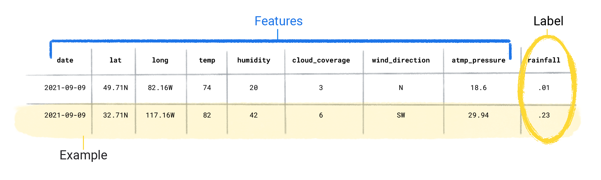
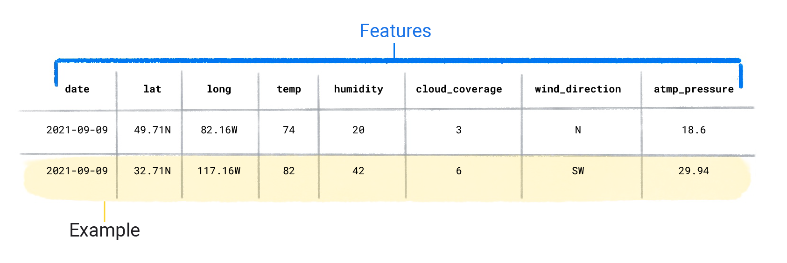

## ➡️ **Useful Materials**

### Original Source

You can find here the original course: [**Supervised Learning**](https://developers.google.com/machine-learning/intro-to-ml/supervised)

## 1️⃣ **Data**

Data is the **driving force** behind machine learning (ML). It can come as words and numbers stored in tables, or in the form of pixel values and waveforms captured in images and audio files.

When we gather related data together, we store it in a *dataset*. For example, we might maintain a dataset of:

- Images of cats  
- Housing prices  
- Weather information  

### Datasets

A dataset is composed of individual *examples*. You can think of an example as analogous to a single row in a spreadsheet.

Each example contains:

1. **Features**  
The values that a supervised model uses to make predictions  
*Example: latitude, longitude, temperature, humidity, and wind direction*

2. **Label**  
The “answer” or the value a supervised model is learning to predict  
*Example: the amount of rainfall*

When an example includes both features and a label, it’s referred to as a **labeled example**.

In contrast, unlabeled examples contain features, but no label.

A dataset is characterized by two key aspects: **size** and **diversity**. **Size** indicates how many examples the dataset contains, while **diversity** reflects the range covered by those examples. Ideally, a dataset should be both **large** and **highly diverse**. However, these properties do not always align. Some datasets may be large but lack variety, whereas others may be highly diverse but include only a small number of examples.

For instance, a dataset could span one hundred years of data but only include information from the month of July. Although this dataset is quite large, its lack of diversity would make it unsuitable for predicting rainfall in January. Conversely, a dataset that covers every month but only spans a few years might not include enough history to handle variability. This highlights the importance of striking a balance between having **enough data** (size) and covering all relevant **conditions** and **variations** (diversity).

A dataset can also be characterized by the number of its **features**. For example, some weather datasets might contain hundreds of features, ranging from satellite imagery to cloud coverage values. Other datasets might include only three or four features, such as humidity, atmospheric pressure, and temperature. Datasets with more features can help a model discover additional **patterns** and potentially make better **predictions**. However, having many features does not always guarantee improved predictions, especially if some of those features have no **causal relationship** to the label.

## 2️⃣ **Model**

In supervised learning, a model is a **mathematical representation** capturing how specific patterns in the **input features** map to particular **output label** values. Through the **training process**, the model adjusts internal parameters - often a **complex set of numerical values** - to discover the best relationship between inputs and outputs. Once trained, the model can then make predictions for new, unseen examples based on the learned patterns.

## 3️⃣ **Training**

**Training** is the process by which a supervised model learns the relationship between features and labels.

To train a model, you provide it with a dataset of labeled examples. The model then repeatedly compares its predicted value to the actual label and measures the difference, known as the **loss**. 

Guided by this loss, it updates its internal parameters to make better predictions in subsequent attempts. For instance, if the model predicts $1.15$ inches of rainfall but the true value is $0.75$ inches, it adjusts its parameters so the next prediction is closer to $0.75$ inches. This process is repeated for all examples in the dataset - often multiple times - until the model converges on a solution that, on average, makes the best predictions

Through this iterative training, the model **learns** how to generalize its understanding of the data, enabling it to make accurate predictions for new, unseen inputs. This gradual understanding is also why large and diverse datasets produce a better model. The model has seen more data with a wider range of values and has refined its understanding of the relationship between the features and the label.

## 4️⃣ **Evaluating**

**Evaluating** a model involves measuring how closely its predictions match the true labels.

To do this, we present the model with a labeled dataset but only supply the features. The model then generates predictions, which we compare to the known label values. The degree of alignment between predictions and actual labels indicates the model’s overall accuracy, helping us confirm whether the model has effectively learned the underlying patterns and can reliably generalize to new, unseen data.
