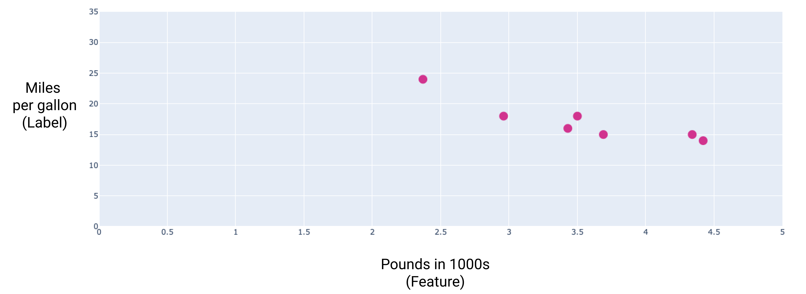
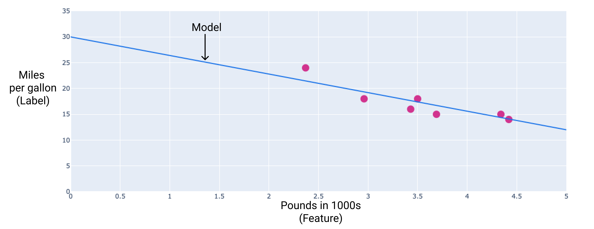
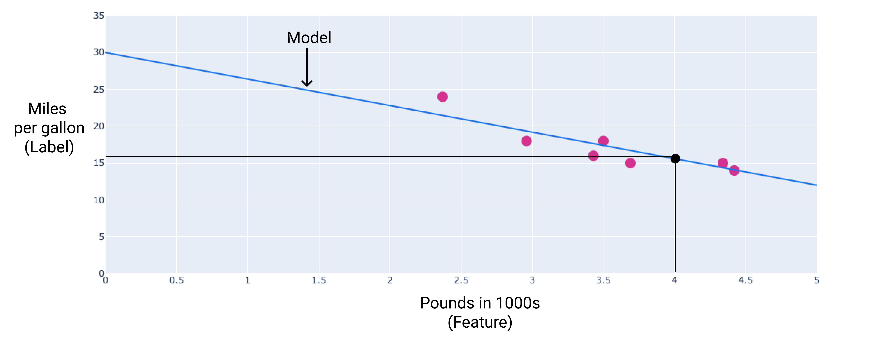
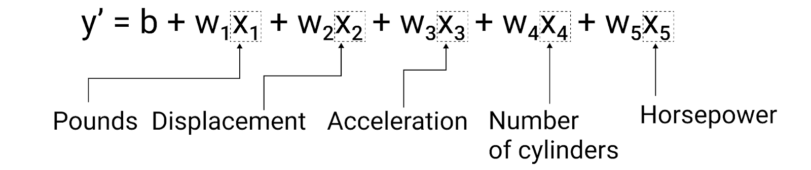
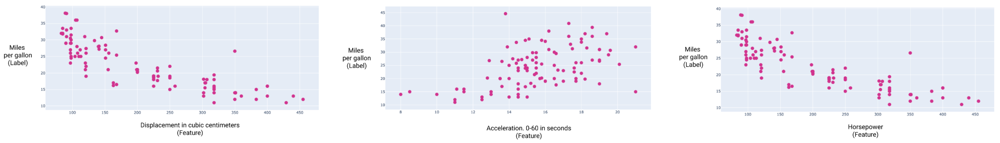
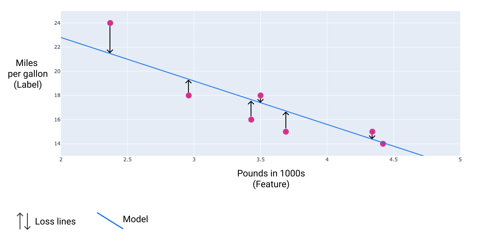
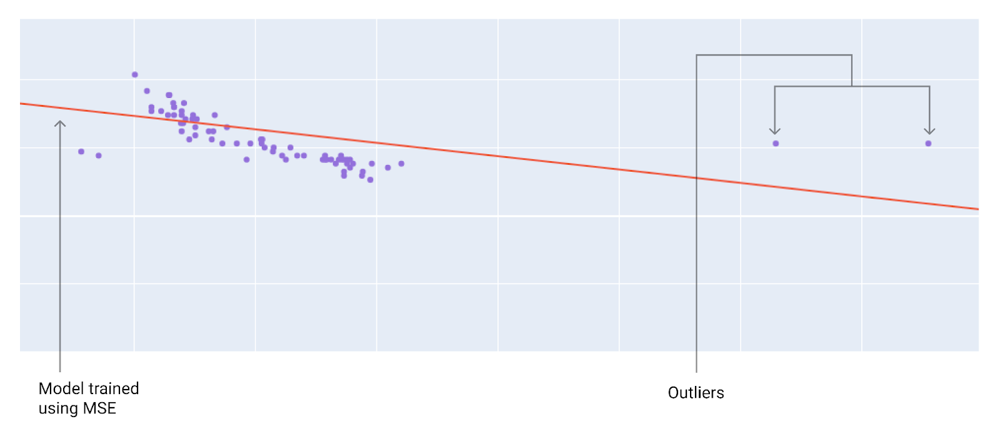
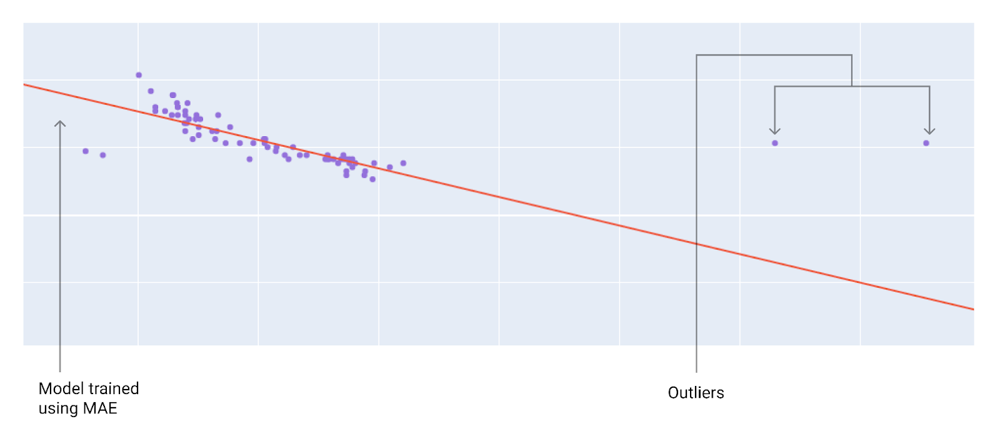
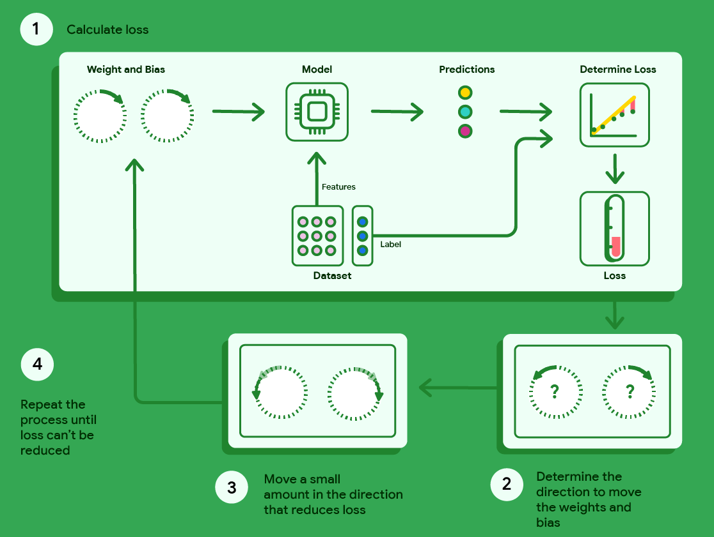

## ➡️ **Useful Materials**

### Original Source

You can find here the original course: [**Linear Regression**](https://developers.google.com/machine-learning/crash-course/linear-regression)

## 1️⃣ **Introduction**

:::info[Definition]

**Linear regression** is a statistical technique used to find the relationship between variables. In an ML context, linear regression finds the relationship between **features** and a **label**.

:::

## 2️⃣ **Example: Fuel Efficiency**

### Single Feature

Linear regression is one of the most straightforward techniques for modeling how an input variable (or set of input variables) relates to an output variable. In this example, we aim to predict a **car’s fuel efficiency**, measured in **miles per gallon** (mpg), based on its **weight** in pounds. Intuitively, heavier cars tend to have lower mpg; the data we observe should help us quantify that relationship and make predictions for new cars.

In our small dataset, we record the weight in thousands of pounds along with the corresponding fuel efficiency in mpg. When plotted, the data points form a downward-sloping trend, confirming the intuitive idea that as weight increases, mpg decreases.

Next, we introduce a line that best fits these points. By “best fit,” we mean that the line is drawn in such a way as to minimize the overall distance between each point and the line itself, reflecting the best average relationship between weight and mpg.

Mathematically, we often express a simple linear regression model using the familiar equation of a line:

$$
y = mx + b
$$

where:

- $y$ is the value we want to predict
- $m$ is the slope
- $x$ is our input variable
- $b$ is the intercept on the $y$-axis.

In machine learning (ML) terminology, we reframe this equation slightly as:

$$
y' = b + w_1 x_1
$$

where:

- $y'$ is the predicted label (the output)
- $b$ (or $w_0$) is called the bias (analogous to the intercept)
- $w_1$ is the weight of our feature (analogous to the slope $m$)
- $x_1$ is the input feature itself.

Both $b$ and $w_1$ are parameters **learned from data during the training phase**.

Each part of the equation corresponds to a different concept in the model: the bias shifts the line up or down, while the weight determines the steepness of the line and whether it slopes upward or downward. In this car example, once the best fitting line is found, the learned parameters turn out to be a bias of $30$ and a weight of $-3.6$. Thus, we can write the model as:
$$
y' = 30 + (-3.6)(x_1)
$$
Here, $y'$ is our predicted mpg, and $x_1$ is the weight of the car in thousands of pounds. Interpreting these values, the slope of $-3.6$ indicates that for every additional thousand pounds in weight, the mpg drops by 3.6, while the model starts at 30 mpg for a hypothetical car with zero weight (which is just a mathematical convenience).

To make a prediction for a new car, simply plug the car’s weight into the model. For example, if a car weighs 4,000 pounds ($x_1 = 4$ in thousands of pounds), its predicted miles per gallon is
$$
y' = 30 + (-3.6)(4) = 30 - 14.4 = 15.6
$$

This predicted mpg aligns with the general downward trend we see in the data. By establishing this linear model, we have a concise way to estimate fuel efficiency for cars of various weights. While this example uses just one feature (car weight), linear regression can incorporate many features, each with its own weight, and remains a foundational technique in machine learning for analyzing relationships between inputs and outputs.

### Multiple Features

Linear regression can naturally extend beyond a single feature to incorporate multiple features. This becomes useful when you want to capture **more complex behavior** than a single input can explain.

For instance, in the simple example above, *weight* alone serves as a predictor of miles per gallon. However, in reality, a car’s mileage often depends on other factors such as *engine displacement*, *acceleration*, *number of cylinders* and *horsepower*.

A model using five features is typically written as:

$$
y' = b + w_1 x_1 + w_2 x_2 + w_3 x_3 + w_4 x_4 + w_5 x_5
$$

This means we have five input features - $x_1$ through $x_5$ - each multiplied by its own learned weight $w_i$. The bias $b$ still shifts the entire plane (or hyperplane, when there are more than two features) up or down.

By plotting these features against miles per gallon, clear patterns emerge:

- As displacement increases, mileage tends to drop.
- Similarly, when a car accelerates more slowly (taking a longer time to reach sixty mph), it often has higher mpg, indicating a positive relationship.
- Meanwhile, horsepower shows the opposite trend, where more powerful engines generally achieve lower mpg, mirroring the negative relationship we saw with weight and displacement.

In practice, fitting a multi-feature linear model involves finding the best values of $b$, $w_1, w_2, \dots$ such that the predictions $y'$ align as closely as possible with the actual mpg values in the training data. The model then generalizes to new cars by plugging in the appropriate values for each feature, thereby leveraging a richer set of inputs for more accurate predictions.

## 3️⃣ **Loss**

### Introduction

Loss is a numerical metric that represents **how far off a model’s predictions are from the true labels**, providing a single value that quantifies the model’s overall error. During training, the goal is to **minimize this loss**, pushing the predictions ever closer to the actual values.

### Distance of loss

In the following image, arrows show the distance between each data point and the model’s prediction; loss captures the magnitude of the error rather than its direction. For example, if a model predicts $2$ when the correct value is $5$, the error might be $-3$ algebraically, but loss treats this simply as a distance of $3$. Consequently, common techniques such as taking the absolute value or squaring the difference ensure the sign of the error is removed, focusing attention purely on **how large the mismatch is**. By reducing this mismatch systematically, the model improves its predictive power.

### Types of loss

In linear regression, several different loss functions can be employed, each reflecting a slightly different perspective on errors. As the following table shows, the fundamental distinction among these common loss types is how they measure the distance between predictions and actual values.

- **L1-based metrics** (the sum or average of absolute differences)  
Treat errors of any magnitude equally.

- **L2-based metrics** (the sum or average of squared differences)  
Emphasize larger errors more heavily. Specifically, squaring magnifies the effect of an error when the difference is big, but downplays it for small differences.

To handle multiple examples at once, it is common to compute the **average loss** - whether via MAE or MSE - so that all examples contribute proportionally to training.

| **Loss type**               | **Definition**                                                        | **Equation**                                             |
|-----------------------------|-----------------------------------------------------------------------|----------------------------------------------------------|
| *L1 loss*                 | Sum of the absolute values of the differences.                        | $\sum \lvert \text{actual value} - \text{predicted value} \rvert$ |
| *Mean absolute error (MAE)* | Average of the L1 losses across a set of examples.                  | $\frac{1}{N} \sum \lvert \text{actual value} - \text{predicted value} \rvert$ |
| *L2 loss*                 | Sum of the squared differences.                                       | $\sum (\text{actual value} - \text{predicted value})^2$  |
| *Mean squared error (MSE)* | Average of the L2 losses across a set of examples.                  | $\frac{1}{N} \sum (\text{actual value} - \text{predicted value})^2$  |

:::tip[Example: Calculating Loss]

Suppose we use the earlier best fit line, where the weight ($w_1$) is $-3.6$ and the bias ($b$) is $30$. If we plug in a weight of $2.37$ (2,370 pounds, since our graphs are scaled to thousands of pounds), the model predicts:

$$
\text{prediction} = b + (w_1 \times 2.37) = 30 + (-3.6 \times 2.37) = 21.5.
$$

However, suppose the true mpg for this car is $24$. The L2 loss (the squared difference) between the model’s prediction and the actual value is:

$$
(\text{actual value} - \text{predicted value})^2 = (24 - 21.5)^2 = 6.25.
$$

In other words, for this single data point, the L2 loss is $6.25$. This number represents the degree to which the model’s prediction deviates from reality, an error the model will try to minimize during training.

:::

### Choosing a loss

When deciding whether to use MAE or MSE, you should consider **how your dataset handles outliers** and how you want the model to treat them. While most car weights fall within 2,000 to 5,000 pounds and typical fuel efficiencies range from 8 to 50 miles per gallon, an 8,000-pound car or a 100-mpg vehicle would be well outside the norm. This kind of outlier can also refer to how far off a model’s prediction is from its actual value. For example, a 3,000-pound car that actually achieves 40 miles per gallon might seem realistic in isolation, but it would be an outlier if the model only predicts 18 to 20 miles per gallon for such a car.

If your model uses MSE, outliers incur a **very large penalty** because the difference between predicted and actual values is squared. Therefore, the model will adjust its parameters more aggressively to reduce errors at these unusual points, sometimes at the expense of slightly worse predictions for the rest of the dataset. By contrast, MAE is **less influenced by outliers** because it takes the absolute value rather than the square. Consequently, MAE tends to keep the model closer to most data points overall, sometimes allowing larger deviations on a few outliers.

Graphically, MSE-trained models often appear closer to outliers, while MAE-trained models stay closer to the bulk of the data. The choice ultimately depends on whether you want the model to emphasize accuracy for outliers or to focus on minimizing errors for typical cases.

## 4️⃣ **Gradient Descent**

Gradient descent is an **iterative algorithm** that systematically searches for the **weight** and **bias** values producing the lowest possible loss.

<iframe
  src="https://www.youtube.com/embed/QoK1nNAURw4"
  title="Machine Learning Crash Course: Gradient Descent"
  frameBorder="0"
  allow="accelerometer; autoplay; clipboard-write; encrypted-media; gyroscope; picture-in-picture"
  allowFullScreen
  className="video-holidays"
>
</iframe>

It begins by assigning random values close to zero for these parameters. Then, at every iteration, it calculates the current loss, determines which direction to adjust the parameters to reduce that loss, and shifts the weight and bias slightly in that direction.

This process repeats until further adjustments do not meaningfully lower the loss. Conceptually, each iteration nudges the parameters down the “slope” of a loss landscape, moving step by step toward the minimum.

As illustrated by the following diagram, gradient descent fine-tunes the model’s parameters until it finds the point of least error, thereby yielding the best-fitting line for your dataset.

