## ➡️ **Useful Materials**

### Original Source

You can find here the original course: [**Linear Regression**](https://developers.google.com/machine-learning/crash-course/linear-regression)

## 1️⃣ **Introduction**

:::info[Definition]

**Linear regression** is a statistical technique used to find the relationship between variables. In an ML context, linear regression finds the relationship between **features** and a **label**.

:::

## 2️⃣ **Example: Fuel Efficiency**

### Single Feature

Linear regression is one of the most straightforward techniques for modeling how an input variable (or set of input variables) relates to an output variable. In this example, we aim to predict a **car’s fuel efficiency**, measured in **miles per gallon** (mpg), based on its **weight** in pounds. Intuitively, heavier cars tend to have lower mpg; the data we observe should help us quantify that relationship and make predictions for new cars.

In our small dataset, we record the weight in thousands of pounds along with the corresponding fuel efficiency in mpg. When plotted, the data points form a downward-sloping trend, confirming the intuitive idea that as weight increases, mpg decreases.


Next, we introduce a line that best fits these points. By “best fit,” we mean that the line is drawn in such a way as to minimize the overall distance between each point and the line itself, reflecting the best average relationship between weight and mpg.


Mathematically, we often express a simple linear regression model using the familiar equation of a line:

$$
y = mx + b
$$

where:

- $y$ is the value we want to predict
- $m$ is the slope
- $x$ is our input variable
- $b$ is the intercept on the $y$-axis.

In machine learning (ML) terminology, we reframe this equation slightly as:

$$
y' = b + w_1 x_1
$$

where:

- $y'$ is the predicted label (the output)
- $b$ (or $w_0$) is called the bias (analogous to the intercept)
- $w_1$ is the weight of our feature (analogous to the slope $m$)
- $x_1$ is the input feature itself.

Both $b$ and $w_1$ are parameters **learned from data during the training phase**.

Each part of the equation corresponds to a different concept in the model: the bias shifts the line up or down, while the weight determines the steepness of the line and whether it slopes upward or downward. In this car example, once the best fitting line is found, the learned parameters turn out to be a bias of $30$ and a weight of $-3.6$. Thus, we can write the model as:
$$
y' = 30 + (-3.6)(x_1)
$$
Here, $y'$ is our predicted mpg, and $x_1$ is the weight of the car in thousands of pounds. Interpreting these values, the slope of $-3.6$ indicates that for every additional thousand pounds in weight, the mpg drops by 3.6, while the model starts at 30 mpg for a hypothetical car with zero weight (which is just a mathematical convenience).

To make a prediction for a new car, simply plug the car’s weight into the model. For example, if a car weighs 4,000 pounds ($x_1 = 4$ in thousands of pounds), its predicted miles per gallon is
$$
y' = 30 + (-3.6)(4) = 30 - 14.4 = 15.6
$$


This predicted mpg aligns with the general downward trend we see in the data. By establishing this linear model, we have a concise way to estimate fuel efficiency for cars of various weights. While this example uses just one feature (car weight), linear regression can incorporate many features, each with its own weight, and remains a foundational technique in machine learning for analyzing relationships between inputs and outputs.

### Multiple Features

Linear regression can naturally extend beyond a single feature to incorporate multiple features. This becomes useful when you want to capture **more complex behavior** than a single input can explain.

For instance, in the simple example above, *weight* alone serves as a predictor of miles per gallon. However, in reality, a car’s mileage often depends on other factors such as *engine displacement*, *acceleration*, *number of cylinders* and *horsepower*.

A model using five features is typically written as:

$$
y' = b + w_1 x_1 + w_2 x_2 + w_3 x_3 + w_4 x_4 + w_5 x_5
$$

This means we have five input features - $x_1$ through $x_5$ - each multiplied by its own learned weight $w_i$. The bias $b$ still shifts the entire plane (or hyperplane, when there are more than two features) up or down.


By plotting these features against miles per gallon, clear patterns emerge:

- As displacement increases, mileage tends to drop.
- Similarly, when a car accelerates more slowly (taking a longer time to reach sixty mph), it often has higher mpg, indicating a positive relationship.
- Meanwhile, horsepower shows the opposite trend, where more powerful engines generally achieve lower mpg, mirroring the negative relationship we saw with weight and displacement.


In practice, fitting a multi-feature linear model involves finding the best values of $b$, $w_1, w_2, \dots$ such that the predictions $y'$ align as closely as possible with the actual mpg values in the training data. The model then generalizes to new cars by plugging in the appropriate values for each feature, thereby leveraging a richer set of inputs for more accurate predictions.

## 3️⃣ **Loss**

### Introduction

Loss is a numerical metric that represents **how far off a model’s predictions are from the true labels**, providing a single value that quantifies the model’s overall error. During training, the goal is to **minimize this loss**, pushing the predictions ever closer to the actual values.


### Distance of loss

In the following image, arrows show the distance between each data point and the model’s prediction; loss captures the magnitude of the error rather than its direction. For example, if a model predicts $2$ when the correct value is $5$, the error might be $-3$ algebraically, but loss treats this simply as a distance of $3$. Consequently, common techniques such as taking the absolute value or squaring the difference ensure the sign of the error is removed, focusing attention purely on **how large the mismatch is**. By reducing this mismatch systematically, the model improves its predictive power.

### Types of loss

In linear regression, several different loss functions can be employed, each reflecting a slightly different perspective on errors. As the following table shows, the fundamental distinction among these common loss types is how they measure the distance between predictions and actual values.

- **L1-based metrics** (the sum or average of absolute differences)  
Treat errors of any magnitude equally.

- **L2-based metrics** (the sum or average of squared differences)  
Emphasize larger errors more heavily. Specifically, squaring magnifies the effect of an error when the difference is big, but downplays it for small differences.

To handle multiple examples at once, it is common to compute the **average loss** - whether via MAE or MSE - so that all examples contribute proportionally to training.

| **Loss type**               | **Definition**                                                        | **Equation**                                             |
|-----------------------------|-----------------------------------------------------------------------|----------------------------------------------------------|
| *L1 loss*                 | Sum of the absolute values of the differences.                        | $\sum \lvert \text{actual value} - \text{predicted value} \rvert$ |
| *Mean absolute error (MAE)* | Average of the L1 losses across a set of examples.                  | $\frac{1}{N} \sum \lvert \text{actual value} - \text{predicted value} \rvert$ |
| *L2 loss*                 | Sum of the squared differences.                                       | $\sum (\text{actual value} - \text{predicted value})^2$  |
| *Mean squared error (MSE)* | Average of the L2 losses across a set of examples.                  | $\frac{1}{N} \sum (\text{actual value} - \text{predicted value})^2$  |

:::tip[Example: Calculating Loss]

Suppose we use the earlier best fit line, where the weight ($w_1$) is $-3.6$ and the bias ($b$) is $30$. If we plug in a weight of $2.37$ (2,370 pounds, since our graphs are scaled to thousands of pounds), the model predicts:

$$
\text{prediction} = b + (w_1 \times 2.37) = 30 + (-3.6 \times 2.37) = 21.5.
$$

However, suppose the true mpg for this car is $24$. The L2 loss (the squared difference) between the model’s prediction and the actual value is:

$$
(\text{actual value} - \text{predicted value})^2 = (24 - 21.5)^2 = 6.25.
$$

In other words, for this single data point, the L2 loss is $6.25$. This number represents the degree to which the model’s prediction deviates from reality, an error the model will try to minimize during training.

:::

### Choosing a loss

When deciding whether to use MAE or MSE, you should consider **how your dataset handles outliers** and how you want the model to treat them. While most car weights fall within 2,000 to 5,000 pounds and typical fuel efficiencies range from 8 to 50 miles per gallon, an 8,000-pound car or a 100-mpg vehicle would be well outside the norm. This kind of outlier can also refer to how far off a model’s prediction is from its actual value. For example, a 3,000-pound car that actually achieves 40 miles per gallon might seem realistic in isolation, but it would be an outlier if the model only predicts 18 to 20 miles per gallon for such a car.

If your model uses MSE, outliers incur a **very large penalty** because the difference between predicted and actual values is squared. Therefore, the model will adjust its parameters more aggressively to reduce errors at these unusual points, sometimes at the expense of slightly worse predictions for the rest of the dataset. By contrast, MAE is **less influenced by outliers** because it takes the absolute value rather than the square. Consequently, MAE tends to keep the model closer to most data points overall, sometimes allowing larger deviations on a few outliers.

Graphically, MSE-trained models often appear closer to outliers, while MAE-trained models stay closer to the bulk of the data. The choice ultimately depends on whether you want the model to emphasize accuracy for outliers or to focus on minimizing errors for typical cases.


## 4️⃣ **Gradient Descent**

Gradient descent is an **iterative algorithm** that systematically searches for the **weight** and **bias** values producing the lowest possible loss.

<iframe
  src="https://www.youtube.com/embed/QoK1nNAURw4"
  title="Machine Learning Crash Course: Gradient Descent"
  frameBorder="0"
  allow="accelerometer; autoplay; clipboard-write; encrypted-media; gyroscope; picture-in-picture"
  allowFullScreen
  className="video-holidays"
>
</iframe>

It begins by assigning random values close to zero for these parameters. Then, at every iteration, it calculates the current loss, determines which direction to adjust the parameters to reduce that loss, and shifts the weight and bias slightly in that direction.

This process repeats until further adjustments do not meaningfully lower the loss. Conceptually, each iteration nudges the parameters down the “slope” of a loss landscape, moving step by step toward the minimum.

As illustrated by the following diagram, gradient descent fine-tunes the model’s parameters until it finds the point of least error, thereby yielding the best-fitting line for your dataset.


## 5️⃣ **Model convergence and loss curves**

When training a model - *particularly with gradient-based methods* - one of the most common diagnostic tools is the **loss curve**. This curve shows how the model’s loss changes over time or across iterations (or epochs) of training. A typical loss curve will steeply decrease early in training, then gradually level out as the model converges.

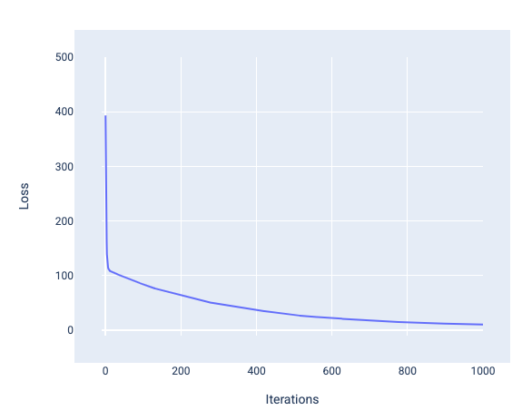

### Interpreting the Loss Curve

- **Rapid Initial Decrease**  
  In the early iterations, large updates to the parameters (weights and bias) typically occur, causing a swift drop in loss. This reflects the model quickly learning rudimentary patterns in the data.

- **Gradual Convergence**  
  As training continues, the slope of the curve flattens because updates become smaller; the model refines its understanding of the data, making ever-finer adjustments. The loss curve often plateaus when the parameters reach a state where further improvements are minimal - this is commonly referred to as **convergence**.

- **Identifying the Convergence Point**  
  The iteration at which the loss curve levels off (for example, around the 1,000th iteration) typically indicates that the model has converged. At this point, additional iterations may not yield substantial improvements in the training loss.

### Snapshots of Model Training

Visualizing snapshots of the model (for instance, in a regression problem) at different points in training makes it clear how updates to weights and bias correspond to decreasing loss.

1. **Early Iterations (e.g., 2nd iteration)**  
   - The model parameters are often close to their initial random values, so predictions are poor.  
   - The *loss lines* in a plot (lines showing the difference between predicted and actual points) are typically long, indicating large errors.
  
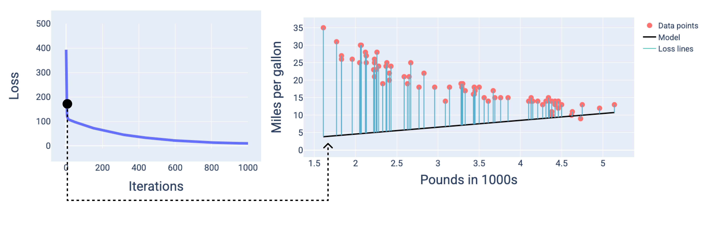

2. **Midway Through Training (e.g., 400th iteration)**  
   - The model has significantly improved; weights and bias are starting to align with the true underlying relationship in the data.  
   - Loss is lower than in the early stage, but there might still be noticeable prediction errors.

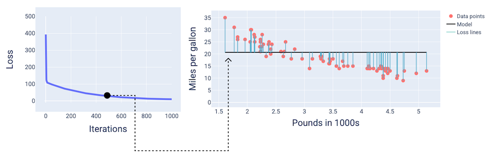

3. **Late Iterations (e.g., 1,000th iteration)**  
   - The model parameters have *converged*, or nearly so, to the optimal values for minimizing loss.  
   - Prediction errors are minimal, and loss lines are much shorter in visualizations.

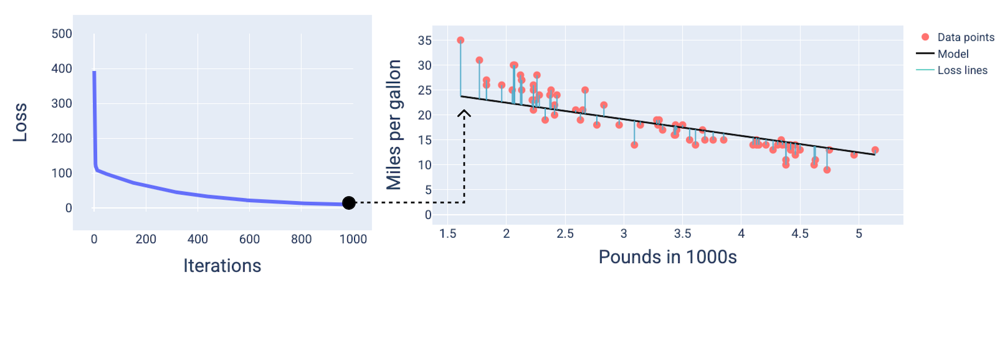

### Factors Affecting Convergence

- **Learning Rate**  
  A learning rate that is too large can cause the loss to oscillate or even diverge, while a learning rate that is too small can slow down training significantly or get stuck in suboptimal minima.

- **Overfitting / Underfitting**  
  While the model may appear to converge on the training set, it’s also important to check validation and test losses to ensure the model is not *overfitting*.  
  If both training and validation losses stop improving, that often indicates genuine convergence.

- **Data Quality and Complexity**  
  Poorly scaled or noisy data can adversely affect the loss curve and delay or prevent proper convergence.  
  The complexity of the chosen model (e.g., neural network depth, number of parameters in linear regression) can also shape the nature of convergence.

### Convergence and convex functions

The loss functions for linear models always produce a **convex** surface.

:::info[Convex Function]

A function in which the region above the graph of the function is a **convex set**.

For example, the following are all convex functions:

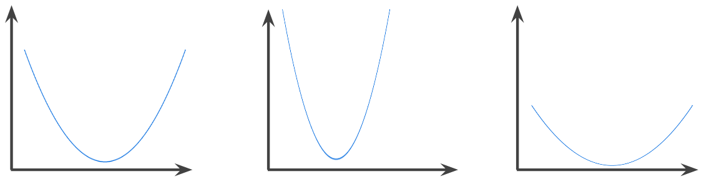

In contrast, the following function is not convex.

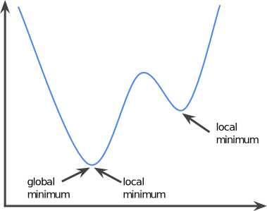

:::

This convexity ensures that when a linear regression model converges, it has found the **optimal** weights and bias that minimize the loss.

If we visualize the loss surface for a model with a single feature, we can observe its characteristic convex shape. In the following example, a weight of $-5.44$ and bias of $35.94$ produce the lowest loss at $5.54$.

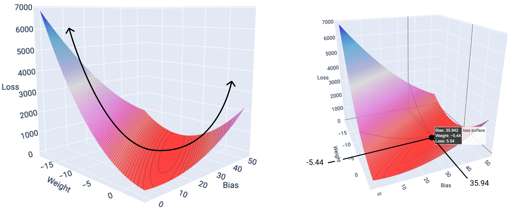

It's important to note that the model almost never finds the exact minimum for each weight and bias, but instead finds a value very close to it. It's also important to note that the minimum for the weights and bias don't correspond to zero loss, only a value that produces the lowest loss for that parameter.

## 6️⃣ **Hyperparameters**

### Introduction

In machine learning, particularly during the training phase, hyperparameters play a critical role in influencing model performance. **Hyperparameters** are variables that the practitioner sets before the training process begins. Unlike model parameters, which the model learns from data during training (such as weights and biases), hyperparameters must be configured manually or through an automated tuning process.

Understanding and effectively choosing hyperparameters is essential for building efficient, accurate machine learning models. This report provides a detailed exploration of hyperparameters, emphasizing three common hyperparameters: **Learning Rate**, **Batch Size**, and **Epochs**.

### Parameters vs. Hyperparameters

To clearly understand hyperparameters, it's crucial to distinguish them from **parameters**:

- **Parameters**  
These are the internal values the model updates during training, such as weights and biases. They are learned directly from the data by minimizing the loss function.

- **Hyperparameters**  
These are external configurations set by the developer before training begins. They control various aspects of the training process but are not updated directly by training algorithms.

### Learning Rate

The **learning rate** is a crucial hyperparameter that controls how rapidly a machine learning model learns by determining the magnitude of the updates to its internal parameters.

The learning rate is typically a **small positive floating-point number** (e.g., $0.01$, $0.001$). It controls how drastically the model adjusts its weights and biases in response to the calculated gradients during training.

- **High Learning Rate**  
Leads to rapid updates and quicker training initially. However, excessively large learning rates can cause instability, preventing convergence and causing the model's parameters to oscillate or diverge.

- **Low Learning Rate**  
Leads to slower updates and stable convergence but increases training duration and may risk becoming stuck in local minima.

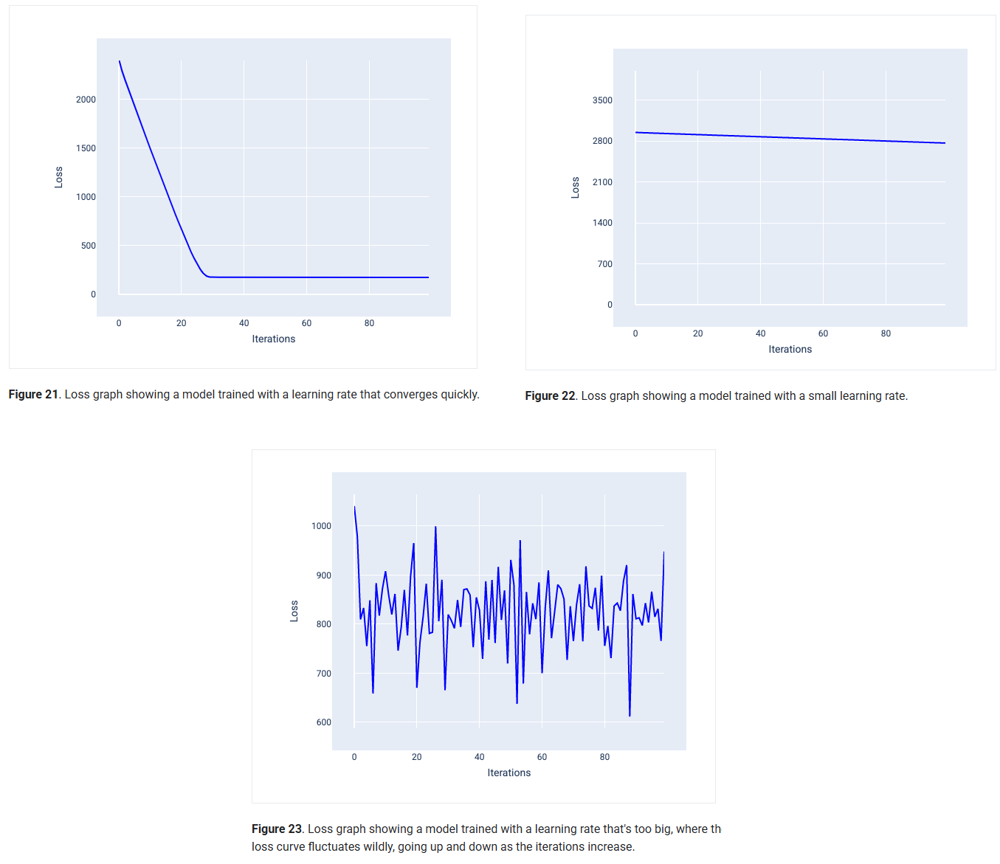

#### ➽ Role in Gradient Descent

In the gradient descent optimization process, the learning rate determines how large a step the model takes in the direction of steepest descent on the loss function:

- After computing gradients (the slope of the loss function concerning each parameter), these gradients are multiplied by the learning rate to update the parameters:
  
$$
\text{new\_parameter} = \text{old\_parameter} - (\text{learning\_rate} \times \text{gradient})
$$

- For example, if the gradient magnitude is $2.5$ and the learning rate is $0.01$, the parameter will change by:
  
$$
2.5 \times 0.01 = 0.025
$$

Thus, the adjustment made at each iteration is proportional both to the learning rate and the gradient magnitude.

#### ➽ Practical Considerations

Selecting the optimal learning rate often involves experimentation and careful tuning. Common approaches include:

- **Learning Rate Schedules**  
Techniques such as exponential decay or cyclic learning rates dynamically adjust the learning rate throughout training.

- **Adaptive Optimizers**  
Algorithms like Adam, RMSProp, or Adagrad automatically adjust the learning rate during training to accelerate convergence and improve stability.

### Batch Size

**Batch size** is a hyperparameter referring to the number of training examples a model processes before updating its weights and biases. It significantly impacts the efficiency and convergence characteristics of the training process.

#### ➽ Definition and Significance

When training machine learning models, you might initially think it's ideal to compute the loss using all examples in the dataset simultaneously (known as **full-batch gradient descent**) before updating parameters. However, in practical scenarios involving datasets with hundreds of thousands or even millions of examples, this approach becomes computationally infeasible due to memory and processing constraints.

Consequently, alternative strategies are employed, particularly:

#### ➽ Stochastic Gradient Descent (SGD)

Stochastic gradient descent involves using a **batch size of one**. In other words, the model updates its parameters after evaluating just a single randomly chosen training example in each iteration.

- **Pros**
  - Rapid parameter updates.
  - Can avoid local minima due to inherent randomness.
- **Cons**
  - High variance and noise, leading to fluctuations in the loss.
  - Less stable convergence, potentially requiring more iterations.

Noise here refers to random fluctuations during training, which can temporarily increase the loss instead of consistently decreasing it. While this can seem undesirable, controlled noise can help models escape local minima, leading to better generalization.

**Illustrative Example**  
A loss curve resulting from training with SGD typically demonstrates significant fluctuations throughout training. Although the loss generally decreases over time, these fluctuations persist even near convergence.

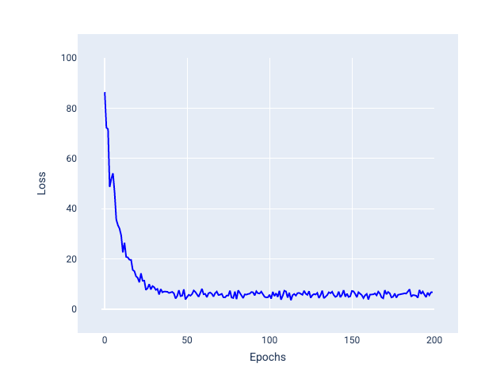

#### ➽ Mini-batch Stochastic Gradient Descent (Mini-batch SGD)

Mini-batch stochastic gradient descent represents a *compromise* between the two extremes of full-batch gradient descent and stochastic gradient descent. Rather than updating parameters after processing every single example or the entire dataset at once, mini-batch SGD updates parameters after processing a **subset of training examples**, typically ranging from dozens to several hundreds or even thousands.

- **Pros**
  - Balances the efficiency of batch processing with the variability and generalization advantages of stochastic methods.
  - Reduced noise compared to SGD.
  - Better hardware utilization and computational efficiency.
- **Cons**
  - Requires tuning batch size to balance convergence stability and computational resources.

The examples included in each mini-batch are selected randomly, and their gradients are averaged. This average gradient is then used for a single parameter update per iteration.

**Illustrative Example**  
A loss curve trained with mini-batch SGD typically shows a smoother decrease than SGD, with fewer and smaller fluctuations, especially near convergence.

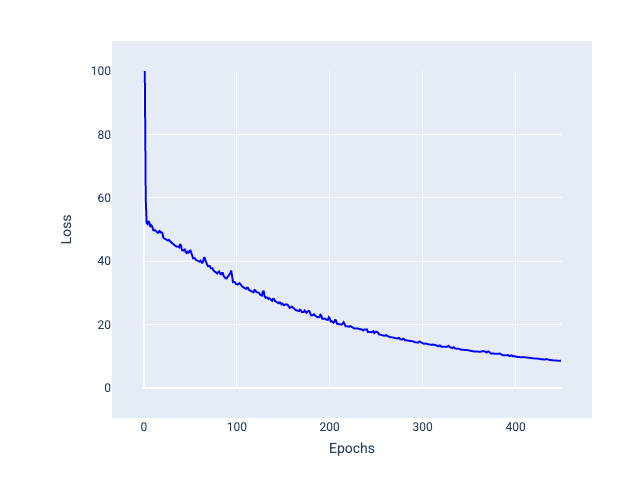

#### ➽ Determining Optimal Batch Size

The optimal batch size depends on multiple factors, such as dataset size, model complexity, and computational resources (e.g., available GPU memory). Generally:

- **Smaller batch sizes**  
Behave similarly to SGD, with higher noise and potentially improved generalization.
- **Larger batch sizes**  
Approach full-batch behavior, offering smoother but potentially slower convergence and possibly worse generalization.

Selecting the batch size thus becomes a trade-off between stability, speed of convergence, computational resources, and the generalization performance of the trained model.

#### ➽ Role of Noise

Although noise might initially appear detrimental because it causes variability in the loss curve, controlled levels of noise introduced by smaller batch sizes can positively influence training:

- Noise can help the model avoid getting trapped in local minima, potentially leading to better generalization.
- Controlled noise can enable the model to explore the loss landscape more effectively, resulting in more robust and generalized parameter values.

As a result, a moderate level of noise - carefully balanced through the batch size - is desirable rather than something to eliminate entirely.

### Epochs

#### ➽ Introduction

An **epoch** occurs when a machine learning model has processed every example in the training dataset exactly once. After completing an epoch, the model has had the opportunity to learn from all available training data.

- **Epoch**  
One complete pass through the entire training dataset
- **Iteration**  
One update of the model's parameters using a batch of data

For example, with a training set of 1,000 examples and a mini-batch size of 100 examples, it takes 10 iterations to complete one epoch.

#### ➽ The Role of Epochs in Model Training

Machine learning models typically require **multiple epochs** to effectively learn patterns in the data because:

1. Complex patterns may not be detected in a single pass
2. The optimization process is iterative and gradual
3. Weight updates are incremental, requiring repeated exposure to data

#### ➽ Epoch-Related Hyperparameters

- **Number of epochs**  
How many times the model will process the entire dataset
- **Batch size**  
How many samples are processed before updating model parameters
- **Learning rate**  
How much to adjust model parameters during each update

#### ➽ Batch Sizes and Parameter Updates

The following table describes how batch size and epochs relate to the number of times a model updates its parameters.

| Batch Type | When Parameters Update | Example (1,000 examples, 20 epochs) |
|------------|------------------------|-------------------------------------|
| Full Batch | After processing the entire dataset | 20 updates (once per epoch) |
| Stochastic Gradient Descent | After each individual example | 20,000 updates (examples × epochs) |
| Mini-Batch SGD | After each batch of examples | 200 updates (with batch size 100) |

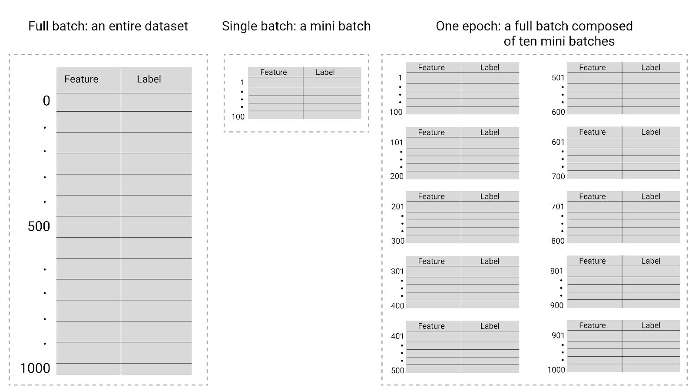

#### ➽ Determining the Optimal Number of Epochs

Here's a list of factors influencing Epoch Count:

1. **Dataset size**  
Larger datasets may require fewer epochs
2. **Model complexity**  
More complex models often need more epochs
3. **Learning rate**  
Lower learning rates typically require more epochs
4. **Regularization**  
Stronger regularization may require more epochs

And here's the signs of appropriate epoch count:

- **Underfitting**  
Too few epochs, model hasn't learned enough
- **Optimal**  
Training and validation metrics have stabilized
- **Overfitting**  
Too many epochs, model memorizes training data, validation metrics worsen

#### ➽ Early Stopping and Monitoring

**Early Stopping** is a technique to automatically determine the optimal number of epochs by:

1. Monitoring validation metrics during training
2. Stopping when validation performance begins to degrade
3. Reverting to the model state with best validation performance

Some of the most commonly monitored metrics during early stopping include:

- **Loss curves**  
These represent the training and validation loss over time. If the validation loss begins to increase while the training loss continues to decrease, it indicates the model is starting to overfit.

- **Accuracy curves**  
Similar to loss curves, these show the training and validation accuracy over epochs. When the validation accuracy stops improving or starts to drop, it is often a sign to stop training.

- **Other task-specific metrics**  
Depending on the specific problem, you may also track other metrics like *F1-score*, *precision*, *recall*, or area under the ROC curve (*AUC*). These are particularly important for imbalanced datasets or when optimization beyond simple accuracy is needed.

## 💻 **Coding Time!**

Here's the link to the interactive [Google Colab notebook](https://colab.research.google.com/github/google/eng-edu/blob/main/ml/cc/exercises/linear_regression_taxi.ipynb?utm_source=mlcc&utm_campaign=colab-external&utm_medium=referral&utm_content=linear_regression#scrollTo=ph0FE7ZxHY36).

We just report here the most important insights.

### Dataset Exploration

Sometimes it is helpful to **visualize relationships between features** in a dataset; one way to do this is with a **pair plot**. A pair plot generates a grid of pairwise plots to visualize the relationship of each feature with all other features all in one place.

:::note[Pairplot]

```python
sns.pairplot(
  training_df,
  x_vars=["FARE", "TRIP_MILES", "TRIP_SECONDS"],
  y_vars=["FARE", "TRIP_MILES", "TRIP_SECONDS"]
  )
```

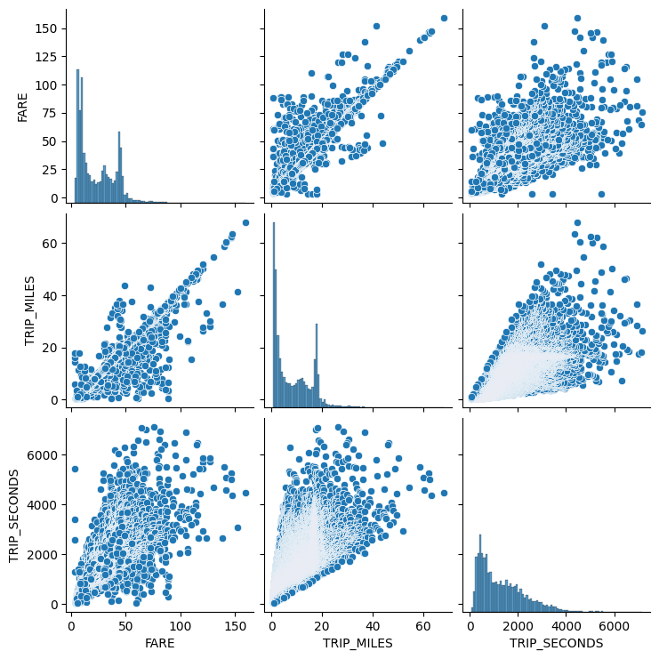

:::

### Scaling

When training machine learning models with multiple features, it's crucial to ensure all numeric values are on a **comparable scale**.

:::tip[Scaling]

The notebook discusses a model trained to predict `FARE` using two features:

- `TRIP_SECONDS` (trip duration in seconds)
- `TRIP_MILES` (trip distance in miles)

These features have significantly different scales:

- `TRIP_MILES` has a mean value of $8.3$
- `TRIP_SECONDS` has a mean value of $1320$

This represents a difference of two orders of magnitude, which can cause problems during training.

---

The example suggests converting trip duration from seconds to minutes as a simple scaling approach. This brings the features to a more comparable scale:

- `TRIP_MILES`: mean of $8.3$
- `TRIP_MINUTES`: mean of approximately $22$ $(1320/60)$

:::

Note: while we demonstrated a simple unit conversion approach, more sophisticated scaling techniques will be covered in subsequent modules.

#### ➽ Problems Caused by Unscaled Features

In linear regression using gradient descent optimization:

- The gradients of the cost function with respect to each feature are proportional to both the feature values and their errors.
- Features with larger values produce larger gradients.
- This causes the optimization algorithm to "step" farther along dimensions with larger scales.
- As a result, the algorithm may oscillate or zigzag through the error space, slowing convergence.
