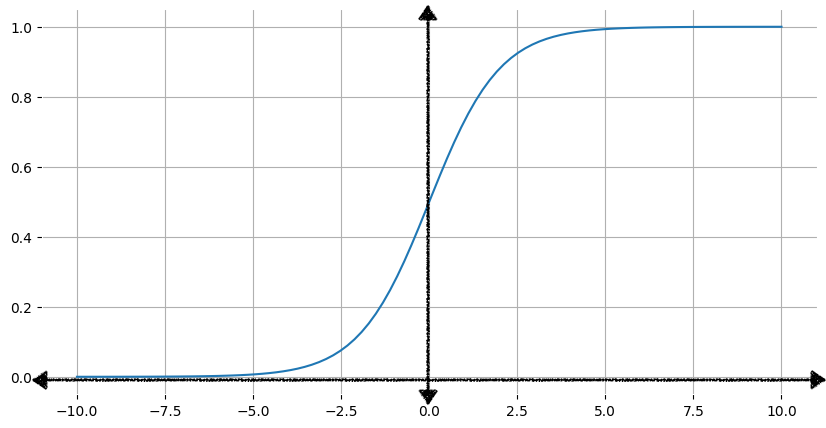
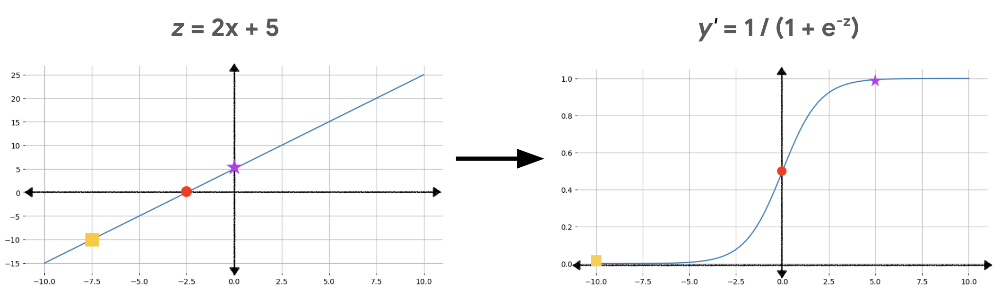

## ➡️ **Useful Materials**

### Original Source

You can find here the original course: [**Logistic Regression**](https://developers.google.com/machine-learning/crash-course/logistic-regression)

<iframe
  src="https://www.youtube.com/embed/72AHKztZN44"
  title="Machine Learning Crash Course: Logistic Regression"
  frameBorder="0"
  allow="accelerometer; autoplay; clipboard-write; encrypted-media; gyroscope; picture-in-picture"
  allowFullScreen
  className="video-holidays"
>
</iframe>

## 1️⃣ **Introduction**

:::info[Definition]

A type of **regression model** that predicts a probability.

:::

Logistic regression models have the following characteristics:

- The label is **categorical**. The term logistic regression usually refers to *binary logistic regression*, that is, to a model that calculates probabilities for labels with two possible values. A less common variant, multinomial logistic regression, calculates probabilities for labels with more than two possible values.

- The loss function during training is **Log Loss**.  
Multiple Log Loss units can be placed in parallel for labels with more than two possible values.

- The model has a linear architecture, not a deep neural network. However, the remainder of this definition also applies to deep models that predict probabilities for categorical labels.

:::tip[Is it spam?]

Consider a logistic regression model that calculates the probability of an input email being either **spam** or **not spam**. During inference, suppose the model predicts $0.72$. Therefore, the model is estimating:

- A 72% chance of the email being spam.
- A 28% chance of the email not being spam.

:::

A logistic regression model uses the following two-step architecture:

1. The model generates a **raw prediction** ($y'$) by applying a **linear function** of input features.
2. The model uses that raw prediction as input to a **sigmoid function**, which converts the raw prediction to a value between $0$ and $1$, exclusive.

Like any regression model, a logistic regression model predicts a number. However, this number typically becomes part of a binary classification model as follows:

- If the predicted number is *greater* than the **classification threshold**, the binary classification model predicts the **positive class**.
- If the predicted number is *less* than the classification threshold, the binary classification model predicts the **negative class**.

## 2️⃣ **Sigmoid function**

You might be curious about how a logistic regression model *guarantees* that its output represents a probability, always producing a value between $0$ and $1$. This is achieved through the use of a specific family of functions known as **logistic functions**, which inherently have outputs within this range.

The most common logistic function is the **sigmoid function** (derived from the Greek word *sigmoid*, meaning "S-shaped"). Its formula is as follows:

$$
f(x) = \frac{1}{1 + e^{-x}}
$$

The sigmoid function has several key properties:

- As the input $x$ increases, the output of the sigmoid function approaches $1$ but never actually reaches it.
- As the input $x$ decreases, the output approaches $0$ but never actually reaches it.

This behavior ensures that the output of the LR model is always interpretable as a probability, bounded between $0$ and $1$.

### Transforming linear output using the sigmoid function

The following equation represents the linear component of a logistic regression model:

$$
z = b + w_1x_1 + w_2x_2 + \ldots + w_Nx_N
$$

To obtain the LR prediction, the $z$ value is then passed to the sigmoid function, yielding a value (a probability) between $0$ and $1$:

$$
y' = \frac{1}{1 + e^{-z}}
$$

where:

- $y'$ is the output of the logistic regression model.
- $z$ is the linear output (as calculated in the preceding equation).

## 3️⃣ **Loss**

As we know, loss functions measure how well a model's predictions align with the true labels. While **squared loss (L2 loss)** is commonly used for linear regression, logistic regression requires a different approach due to its unique output constraints and non-linear nature.

### Linear vs. Logistic Regression Dynamics

- **Linear regression**  
Outputs ($y'$) change at a constant rate. For example, $y' = b + 3x_1$ increases by $3$ for every unit increase in $x_1$.  
- **Logistic regression**  
Outputs are probabilities bounded between $0$ and $1$ via the **sigmoid function**. The sigmoid’s S-shaped curve means the rate of change in output is *not constant* (see table).

When $z$ is near 0, small changes in $z$ significantly affect the predicted probability ($y'$). However, as $z$ becomes large (positive or negative), the sigmoid curve flattens, and $y'$ approaches 0 or 1 asymptotically.  

| Input ($z$) | Logistic Output ($y'$) | Required Digits of Precision |
|-------------|------------------------|------------------------------|
| 5           | 0.993                  | 3                            |
| 6           | 0.997                  | 3                            |
| 7           | 0.999                  | 3                            |
| 8           | 0.9997                 | 4                            |
| 9           | 0.9999                 | 4                            |
| 10          | 0.99998                | 5                            |

As $y'$ nears $0$ or $1$, squared loss struggles to capture tiny differences between predictions and labels, demanding impractical levels of numerical precision. This leads to inefficient memory usage and unstable training.

### The Logistic Regression Loss Function

Log Loss (or **cross-entropy loss**) addresses the limitations of squared loss by penalizing errors logarithmically. The formula is:  
$$
\text{Log Loss} = \sum_{(x,y)\in D} \left[ -y \log(y') - (1 - y) \log(1 - y') \right]
$$  

Where:

- $D$: Dataset of $(x, y)$ pairs.  
- $y$: True label ($0$ or $1$).  
- $y'$: Predicted probability (between $0$ and $1$).  

#### ➽ Intuition and Behavior

For $y = 1$: Loss $= -\log(y')$

- If $y' \approx 1$, loss $\approx 0$
- If $y' \approx 0$, loss $\to \infty$

For $y = 0$: Loss $= -\log(1 - y')$

- If $y' \approx 0$, loss $\approx 0$
- If $y' \approx 1$, loss $\to \infty$

This asymmetry ensures confident incorrect predictions (e.g., predicting $0.01$ for a true label of $1$) are heavily penalized, aligning with probabilistic interpretation.

## 4️⃣ **Regularization**

Regularization is a mechanism for **penalizing model complexity** during training. It is essential in logistic regression to prevent overfitting, especially when dealing with high-dimensional datasets or correlated features. Without regularization, the asymptotic nature of the sigmoid function *could drive the loss toward zero indefinitely*, leading to excessively large coefficients and poor generalization.

### L2 Regularization (Ridge Regularization)

L2 regularization adds a penalty term to the loss function proportional to the squared magnitude of the model’s coefficients. The modified Log Loss becomes:  

$$
\text{Regularized Log Loss} = \sum_{(x,y)\in D} \left[ -y \log(y') - (1 - y) \log(1 - y') \right] + \frac{\lambda}{2} \sum_{i=1}^n w_i^2
$$

**Key Terms**

- $w_i$: Model coefficients.  
- $\lambda$: Regularization strength (hyperparameter). Larger $\lambda$ values increase the penalty, shrinking coefficients toward zero.  

#### ➽ **Advantages of L2 Regularization**

- Prevents overfitting by discouraging large coefficient values.  
- Stabilizes the model in the presence of multicollinearity.  
- Ensures numerical stability during optimization.  

### Early Stopping

Early stopping halts the training process before the model fully converges, typically by monitoring validation loss. Training is stopped once the loss on a validation set begins to increase, indicating potential overfitting.  

**Advantages of Early Stopping**

- Computationally efficient (avoids unnecessary iterations).  
- Effective for large datasets or models with many features.  
- Implicitly controls model complexity without modifying the loss function.  

### Comparison of Strategies

| **Strategy**       | **Mechanism**                          | **Use Case**                          |  
|---------------------|----------------------------------------|---------------------------------------|  
| *L2 Regularization* | Penalizes large coefficients via loss function. | High-dimensional data, correlated features. |  
| *Early Stopping*  | Limits training steps to prevent overfitting. | Large datasets, limited computational resources. |  

## 5️⃣ **5. Conclusion**

Log Loss is the natural choice for logistic regression due to its alignment with the model’s probabilistic outputs. However, to ensure robust performance, regularization techniques like **L2 regularization** and **early stopping** are critical. These strategies mitigate overfitting, stabilize training, and improve generalization, making them indispensable in real-world applications of logistic regression.
