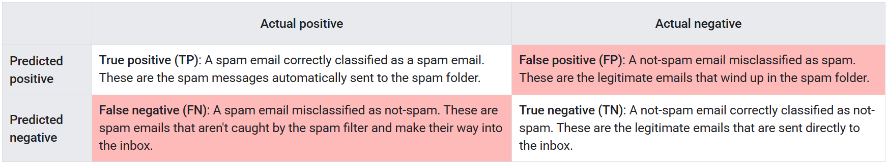
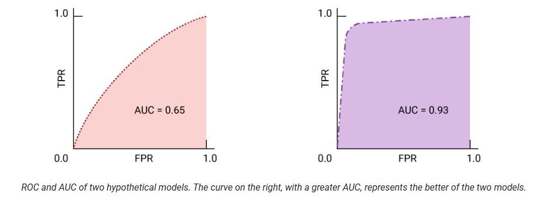
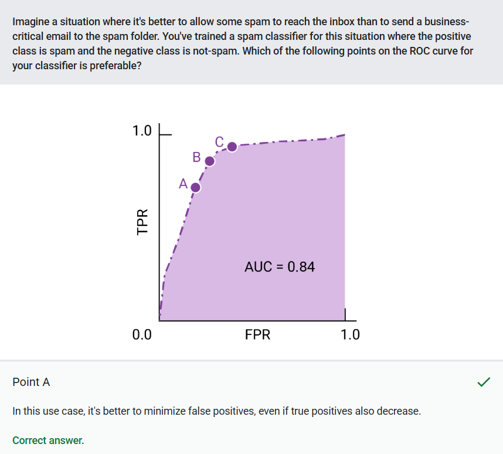

## ➡️ **Useful Materials**

### Original Source

You can find here the original course: [**Classification**](https://developers.google.com/machine-learning/crash-course/classification)

## 1️⃣ **Introduction**

:::info[Definition]

Classification is the task of predicting which of a set of classes (categories) an example belongs to.

:::

## 2️⃣ **Thresholds and the Confusion Matrix**

In logistic regression models (e.g., spam detection), predictions are probabilities between $0$ and $1$. To convert these probabilities into discrete classes (e.g., "spam" or "not spam"), a **classification threshold** is applied:

- **Above the threshold**  
Assigned to the *positive class* (e.g., spam)

- **Below or equal to the threshold**  
Assigned to the *negative class* (e.g., not spam)

:::tip[Examples]

- Prediction = $0.99$ → Classified as *spam* (threshold = $0.5$)
- Prediction = $0.51$ → Classified as *spam* (threshold = $0.5$)
- Prediction = $0.51$ → Classified as *not spam* (threshold = $0.95$)

:::

### Confusion Matrix

A confusion matrix evaluates a classifier’s performance by comparing its predictions to the **ground truth**. For a binary problem like spam detection, the matrix organizes outcomes into four categories:

1. **True Positives (TP)**: Emails correctly classified as spam.  
2. **False Positives (FP)**: Legitimate emails incorrectly marked as spam.  
3. **True Negatives (TN)**: Legitimate emails correctly left in the inbox.  
4. **False Negatives (FN)**: Spam emails mistakenly allowed into the inbox.  



The matrix’s rows represent predictions (spam vs. not spam), and its columns reflect reality. For example:  

- **Row totals** show how many emails the model labeled as spam ($TP + FP$) or not spam ($FN + TN$).
- **Column totals** reveal the actual number of spam ($TP + FN$) and non-spam ($FP + TN$) emails.

#### ➽ Imbalanced Datasets

When the actual positives (e.g., spam) are vastly outnumbered by negatives (e.g., legitimate emails), the dataset is **imbalanced**. Consider a dataset of cloud photos where the rare “volutus” cloud type appears only a few times. Here, even a high-accuracy model could fail to detect volutus clouds because it optimizes for the majority class. The confusion matrix highlights this imbalance: a model that always predicts “not volutus” would have high accuracy but zero true positives.  

#### ➽ Why This Matters

The confusion matrix quantifies trade-offs inherent in threshold selection:

- A **high threshold** (e.g., $0.95$) reduces false positives but risks missing true positives.  
- A **low threshold** (e.g., $0.1$) catches more true positives but increases false alarms.  

By analyzing the matrix, practitioners can align thresholds with real-world priorities, whether minimizing false alarms in legal document review or ensuring rare diseases are not missed in medical testing.  

<iframe
  src="https://www.youtube.com/embed/QM0sYbEQSkM"
  title="Machine Learning Crash Course: Classification"
  frameBorder="0"
  allow="accelerometer; autoplay; clipboard-write; encrypted-media; gyroscope; picture-in-picture"
  allowFullScreen
  className="video-holidays"
>
</iframe>

## 3️⃣ **Accuracy, recall, precision, and related metrics**

True and false positives and negatives are used to calculate several useful **metrics** for evaluating models. Which evaluation metrics are most meaningful depends on the specific model and the specific task, the cost of different misclassifications, and whether the dataset is balanced or imbalanced.

All of the metrics in this section are calculated at a single fixed threshold, and change when the threshold changes. Very often, the user tunes the threshold to optimize one of these metrics.

### Accuracy

:::info[Definition]

Accuracy is the proportion of all classifications that were correct, whether positive or negative. 

:::

It is mathematically defined as:

$$
\text{Accuracy} =
\frac{\text{correct classifications}}{\text{total classifications}}
= \frac{TP+TN}{TP+TN+FP+FN}
$$

In the spam classification example, accuracy measures the fraction of all emails correctly classified.

#### ➽ Limitations

Accuracy can be misleading for imbalanced datasets.

For instance, a model predicting “not spam” 100% of the time would achieve **99% accuracy** if only 1% of emails are spam, despite failing to detect any spam.

#### ➽ When to use?

As a baseline metric for generic tasks with balanced classes.

### Recall (True Positive Rate)

The **true positive rate (TPR)**, or the proportion of all actual positives that were classified correctly as positives, is also known as **recall**.

Recall is mathematically defined as:

$$
\text{Recall (or TPR)} =
\frac{\text{correctly classified actual positives}}{\text{all actual positives}}
= \frac{TP}{TP+FN}
$$

**False negatives** are **actual positives** that were **misclassified** as negatives, which is why they appear in the denominator.

In the spam classification example, recall measures the fraction of spam emails that were correctly classified as spam. This is why another name for recall is **probability of detection**: it answers the question *"What fraction of spam emails are detected by this model?"*

A hypothetical perfect model would have zero false negatives and therefore a recall (TPR) of $1.0$, which is to say, a 100% detection rate.

#### ➽ Limitations

Does not account for false positives. A model with high recall may overflag legitimate emails as spam.

#### ➽ When to use?

Imbalanced datasets where the **positive class is rare but critical** (e.g., fraud detection, medical diagnosis). For applications like these, correctly identifying the positive cases is crucial. A false negative typically has more serious consequences than a false positive.

### False Positive Rate

The **false Positive Rate (FPR)** is the proportion of all actual negatives that were classified incorrectly as positives, also known as the **probability of false alarm**. It is mathematically defined as:

$$
\text{FPR} =
\frac{\text{incorrectly classified actual negatives}}
{\text{all actual negatives}}
= \frac{FP}{FP+TN}
$$

**False positives** are **actual negatives** that were **misclassified**, which is why they appear in the denominator.

In the spam classification example, FPR measures the fraction of legitimate emails that were incorrectly classified as spam, or the model's rate of false alarms.

A perfect model would have zero false positives and therefore a FPR of $0.0$, which is to say, a 0% false alarm rate.

#### ➽ Limitations

Less meaningful when actual negatives are extremely rare (e.g., only 1–2 negatives in the dataset).

#### ➽ When to use?

Applications prioritizing minimal false alarms (e.g., security systems).

### Precision

**Precision** is the proportion of all the model's positive classifications that are actually positive. It is mathematically defined as:

$$
\text{Precision} =
\frac{\text{correctly classified actual positives}}
{\text{everything classified as positive}}
= \frac{TP}{TP+FP}
$$

In the spam classification example, precision measures the fraction of emails classified as spam that were actually spam.

A hypothetical perfect model would have zero false positives and therefore a precision of $1.0$.

#### ➽ Limitations

In an imbalanced dataset where the number of actual positives is very, very low, say 1-2 examples in total, precision is less meaningful and less useful as a metric.

Moreover, it does not penalize false negatives. A high-precision model might miss many true positives.

#### ➽ When to use?

Tasks requiring high confidence in positive predictions (e.g., product recommendations).

### Trade-offs and Threshold Tuning

#### ➽ Precision-Recall Trade-off

Precision improves as false positives decrease, while recall improves when false negatives decrease. But as seen in the previous section, increasing the classification threshold tends to decrease the number of false positives and increase the number of false negatives, while decreasing the threshold has the opposite effects. As a result, **precision and recall often show an inverse relationship**, where improving one of them worsens the other.

- **Increasing the threshold** raises precision (fewer FP) but lowers recall (more FN).  
- **Decreasing the threshold** raises recall (fewer FN) but lowers precision (more FP).  

### F1-Score: Balancing Precision and Recall

The F1-score harmonizes precision and recall into a single metric, calculated as the **harmonic mean** of the two:

$$
\text{F1-Score} = \frac{2 \cdot \text{Precision} \cdot \text{Recall}}{\text{Precision} + \text{Recall}}
$$

Unlike the arithmetic mean, the harmonic mean penalizes extreme imbalances between precision and recall. For example, a model with precision=$1.0$ and recall=$0.5$ would have an arithmetic mean of $0.75$ but an F1-score of $0.67$. This makes the F1-score especially useful when both false positives and false negatives carry significant costs, such as in medical diagnosis or fraud detection.  

#### ➽ Limitations

- Assumes equal importance of precision and recall, which may not align with domain-specific priorities.  
- Less interpretable than precision or recall alone.  

#### ➽ When to use?

- Imbalanced datasets where neither precision nor recall should dominate.  
- Scenarios requiring a balanced view of model performance (e.g., quality control systems).  

## 4️⃣ **ROC and AUC**

### Receiver-operating characteristic curve (ROC)

The ROC curve is a visual representation of **model performance across all thresholds**.

It is drawn by calculating the true positive rate (TPR) and false positive rate (FPR) at every possible threshold (in practice, at selected intervals), then graphing TPR over FPR.

A perfect model, which at some threshold has a TPR of $1.0$ and a FPR of $0.0$, can be represented by either a point at $(0, 1)$ if all other thresholds are ignored, or by the following:


### Area under the curve (AUC)

The area under the ROC curve (AUC) represents the **probability** that the model, if given a randomly chosen positive and negative example, **will rank the positive higher than the negative**.

The perfect model above, containing a square with sides of length 1, has an area under the curve (AUC) of $1.0$.

For a binary classifier, a model that does exactly as well as random guesses or coin flips has a ROC that is a diagonal line from $(0,0)$ to $(1,1)$. The AUC is $0.5$, representing a 50% probability of correctly ranking a random positive and negative example.


#### ➽ When to use?

AUC and ROC work well for comparing models when the dataset is roughly balanced between classes.

#### ➽ Limitations

When the dataset is imbalanced, precision-recall curves (PRCs) and the area under those curves may offer a better comparative visualization of model performance. Precision-recall curves are created by plotting precision on the y-axis and recall on the x-axis across all thresholds.


### AUC and ROC for choosing model and threshold

As we said, AUC is a useful measure for comparing the performance of two different models, as long as the dataset is roughly balanced.

The model with **greater area under the curve** is generally the **better** one.



The points on a ROC curve closest to $(0,1)$ represent a range of the best-performing thresholds for the given model. The threshold you choose depends on **which metric is most important to the specific use case**.

Consider the points $A$, $B$, and $C$ in the following diagram, each representing a threshold:


- If **false positives** (false alarms) are **highly costly**, it may make sense to choose a threshold that gives a lower FPR, like the one at point $A$, even if TPR is reduced.

- If **false positives** are **cheap** and **false negatives** (missed true positives) **highly costly**, the threshold for point $C$, which maximizes TPR, may be preferable.

- If the costs are roughly **equivalent**, point $B$ may offer the best balance between TPR and FPR.

#### ➽ Example



## 5️⃣ **Prediction bias**

### Introduction

Prediction bias is an important diagnostic metric for evaluating machine learning models. It represents the **difference** between the **average of a model's predictions** and the **average of the actual ground-truth labels** in the dataset.

Prediction bias occurs when a model's predictions systematically deviate from the actual values in the dataset. Mathematically, it is calculated as:

$$
\text{Prediction Bias} = Average(\text{Predictions}) - Average(\text{Ground Truth Labels})
$$

For example, if a dataset contains 5% spam emails, an unbiased model should predict, on average, that 5% of emails are spam. If the model instead predicts that 10% of emails are spam, it has a prediction bias of +5%.

### Significance of Prediction Bias

Prediction bias serves as an early warning system for model issues. A significant bias indicates that:

- The model is not accurately representing the underlying data distribution
- There may be fundamental problems with the model architecture or training process
- The model might perform poorly on new, unseen data

It's important to note that even a model with zero prediction bias can still have other problems, such as poor precision or recall for specific classes.

### Common Causes of Prediction Bias

#### ➽ Data Issues

- **Biased sampling**  
Training data that doesn't represent the true distribution of the target population
- **Data noise**  
Errors or inconsistencies in the ground truth labels
- **Dataset shift**  
Differences between training and evaluation datasets

#### ➽ Model Issues

- **Excessive regularization**  
Over-constraining the model, causing it to lose necessary complexity
- **Insufficient model capacity**  
Model architecture that's too simple for the problem
- **Inappropriate loss function**  
Using a loss function that doesn't properly penalize bias

#### ➽ Feature Issues

- **Insufficient features**  
Missing important predictive variables
- **Feature distribution issues**  
Features that behave differently in training versus inference

#### ➽ Pipeline Issues

- **Bugs in preprocessing**  
Errors in how data is transformed before model training
- **Incorrect evaluation**  
Problems with how model performance is assessed

## 6️⃣ **Multi-class classification**

:::info[Definition]

Multi-class classification is a machine learning task where the goal is to categorize examples into one of three or more classes.

:::

It can be treated as an **extension** of binary classification to more than two classes. If each example can only be assigned to one class, then the classification problem can be handled as a binary classification problem, where one class contains one of the multiple classes, and the other class contains all the other classes put together. The process can then be repeated for each of the original classes.

:::tip[Digit Recognition]

A classic example of multi-class classification is handwritten digit recognition:

- Input: Image of a handwritten digit
- Output: Classification into one of 10 classes (digits 0-9)
- Each image belongs to exactly one class
- Models must learn features that distinguish between all ten digits

:::

*Note: we will explore this topic in more depth in future modules.*

## 💻 **Coding Time!**

Here's the link to the interactive [Google Colab notebook](https://colab.research.google.com/github/google/eng-edu/blob/main/ml/cc/exercises/binary_classification_rice.ipynb).

We just report here the most important insights.

### Logistic Regression in Keras

```python
import tensorflow as tf
from tensorflow import keras

def create_logistic_regression_model(
    input_features: list[str],
    learning_rate: float,
    metrics: list[keras.metrics.Metric]
) -> keras.Model:
    """
    Creates and compiles a simple single-layer neural network for binary 
    classification, equivalent to logistic regression.

    Args:
        input_features (list[str]): A list of feature names. Each feature
            corresponds to one scalar input.
        learning_rate (float): Learning rate for the optimizer.
        metrics (list[keras.metrics.Metric]): List of metric instances to track.

    Returns:
        keras.Model: A compiled Keras model representing logistic regression.
    """

    # --------------------------------------------------------------------------
    # 1. Define the Inputs
    # Here, we create one Keras Input for each feature. Each input is a scalar 
    # (shape=(1,)) because logistic regression expects numeric features that 
    # can be fed into a linear combination.
    # --------------------------------------------------------------------------
    model_inputs = [
        keras.Input(name=feature, shape=(1,))
        for feature in input_features
    ]

    # --------------------------------------------------------------------------
    # 2. Concatenate the Inputs
    # We merge all separate input tensors into a single tensor using the 
    # Concatenate layer. This single tensor will be fed into our Dense layer 
    # (the logistic regression layer).
    # --------------------------------------------------------------------------
    concatenated_inputs = keras.layers.Concatenate()(model_inputs)

    # --------------------------------------------------------------------------
    # 3. Single Dense Layer with Sigmoid Activation
    # A logistic regression model can be viewed as:
    #   y = sigmoid(W^T x + b)
    # where x is the input (in this case, the concatenated features), and
    # W and b are learnable parameters.
    # 
    # In Keras:
    #   - units=1: we only need a single output value (the probability of 
    #     belonging to the positive class).
    #   - activation='sigmoid': applies the logistic function, transforming 
    #     the linear combination into a probability between 0 and 1.
    # --------------------------------------------------------------------------
    model_output = keras.layers.Dense(
        units=1,
        activation='sigmoid',  # logistic activation
        name='logistic_regression_output'
    )(concatenated_inputs)

    # --------------------------------------------------------------------------
    # 4. Create the Keras Model
    # We define a Keras Model by specifying the inputs and the output. 
    # --------------------------------------------------------------------------
    model = keras.Model(inputs=model_inputs, outputs=model_output)

    # --------------------------------------------------------------------------
    # 5. Compile the Model
    # - We use BinaryCrossentropy as the loss function for binary classification.
    # - RMSprop is the chosen optimizer here, although many optimizers 
    #   (e.g. Adam, SGD) could also be used.
    # - We pass in any additional metrics we want to track.
    # --------------------------------------------------------------------------
    model.compile(
        optimizer=keras.optimizers.RMSprop(learning_rate),
        loss=keras.losses.BinaryCrossentropy(),
        metrics=metrics,
    )

    return model
```
