## ➡️ **Useful Materials**

### Original Source

You can find here the original course: [**Working with Numerical Data**](https://developers.google.com/machine-learning/crash-course/numerical-data)

## 1️⃣ **How a model ingests data using feature vectors**

Models do not simply act on entire dataset rows. Instead, they ingest **feature vectors** — arrays of floating-point values representing selected columns (features). Critically, these values are often transformed rather than used raw, because models typically learn more effectively from processed data than from unaltered values.

This transformation process, called **feature engineering**, is vital in machine learning. Common techniques include:

- **Normalization**  
Converting numerical values into a standard range.

- **Binning** (bucketing)  
Converting numerical values into discrete ranges.

Furthermore, many features (like strings) must be converted into floating-point values before the model can use them. You’ll see how to handle these conversions in *Working with Categorical Data*.

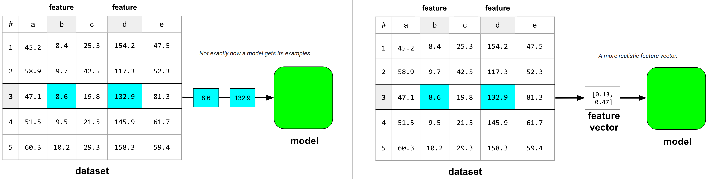

## 2️⃣ **First Steps**

### Recommendations

Before creating feature vectors, it is highly recommended to analyze numerical data in two key ways:

1. **Visualize Your Data**  
   - Use scatter plots or histograms to uncover anomalies or patterns.  
   - Visualize not only at the start of the pipeline, but also after each transformation to validate assumptions.  
   - Tools like **[pandas](https://pandas.pydata.org/)** help with both handling missing data and creating visualizations.  
   - Note that certain visualization tools work better with specific data formats.

2. **Statistically Evaluate Your Data**  
   - Calculate basic statistics (mean, median, standard deviation) for potential features and labels.  
   - Check quartile divisions (0th, 25th, 50th, 75th, and 100th percentiles) to identify outliers.

### Find Outliers

- **Outliers** are values far from most of the data in a feature or label and can disrupt model training.  
- A large difference between the (0th–25th) and (75th–100th) percentile ranges typically indicates outliers.

:::warning[Statistics are not enough!]

Basic statistics alone aren’t enough — always be vigilant for hidden anomalies.

:::

Outliers fall into two main categories:

1. **Mistakes** (typos, measurement errors). Generally remove these.  
2. **Legitimate Data Points**. Decide whether your model must predict well on these:  
   - **Yes**: Keep them, since legitimate outliers in features can reflect corresponding outliers in labels and thus improve predictions. However, extreme outliers may still degrade performance.  
   - **No**: Remove or apply more invasive feature engineering (e.g., clipping).

### Tips for Interpreting Basic Statistics

#### ➽ Describe Method

Use `df.describe()` to quickly generate a summary of each numerical column in a DataFrame.

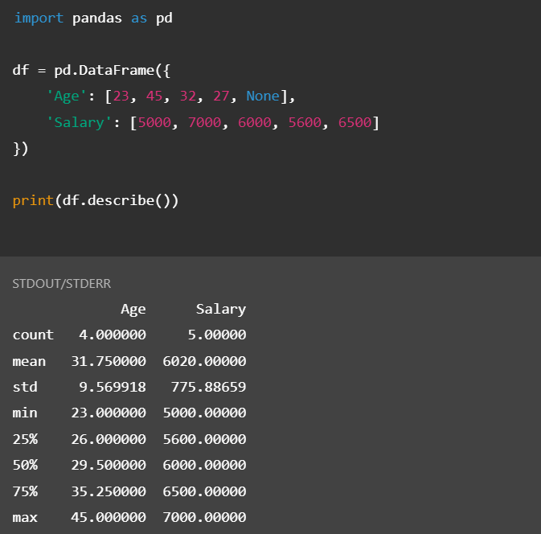

By examining these statistics, you can spot missing data, skewed distributions, and outliers early in your data analysis process, helping ensure better downstream model performance.

#### ➽ Count

Represents the number of non-missing values in each column. Ideally, all columns have the same count. If not, investigate missing data or anomalies.  

#### ➽ Mean vs. Median

- **Mean**  
The arithmetic average of all values in a column.
- **Median (50% Row)**  
The midpoint of all values.  

Comparing the mean to the median reveals whether data is skewed. **Skewed data** is data that creates an uneven curve distribution on a graph. We know data is skewed when the statistical distribution's curve appears distorted to the left or right.

#### ➽ Standard Deviation (std)

It measures the *spread of data from the mean*. A high standard deviation suggests a wide range of values; a low standard deviation means the values cluster around the mean.  

#### ➽ Min, 25%, 50%, 75%, and Max

These are the percentile cutoffs in each column.  

- **Min (0%) and Max (100%)**  
The smallest and largest values, respectively.  
- **25% (Lower Quartile) and 75% (Upper Quartile)**  
Show where the data is “quartered” and can help reveal outliers.  
- **50%**  
Equivalent to the median.  

## 3️⃣ **Normalization**

In the realm of machine learning, **effective data preprocessing** is essential to ensure the optimal performance of models. One crucial aspect of this process is **normalization**, which refers to the technique of adjusting features so that they are on a similar scale. The purpose of normalization is to improve the performance and efficiency of the model training process by eliminating issues caused by features with differing scales.

### Understanding the Need for Normalization

Consider two features, **Feature X** and **Feature Y**, with the following ranges:

- Feature X spans from $154$ to $24,917,482$.
- Feature Y spans from $5$ to $22$.

The scale difference between these two features is stark: **Feature X** spans **multiple orders of magnitude**, while **Feature Y** has a much **narrower range**. If we were to input this data into a machine learning model without normalization, the model would assign a disproportionate weight to Feature X due to its broader range. This is because many machine learning algorithms rely on distance metrics (e.g., Euclidean distance) or gradient-based methods (like gradient descent), which are sensitive to the scale of the features. In this scenario, Feature X would dominate the model's learning process, leading to suboptimal model performance.

Normalization is the process of scaling the features to a common range, typically $[0, 1]$ or $[-1, 1]$, to mitigate the issues associated with such disparate ranges. This can lead to better model convergence and improved performance during both training and prediction.

### Benefits of Normalization

Normalization confers several important benefits that can significantly enhance the performance and efficiency of machine learning models:

#### ➽ Faster Convergence During Training

When features are on vastly different scales, optimization algorithms like gradient descent face challenges during training. Specifically, the gradient updates for features with larger ranges may dominate, while those with smaller ranges may change more slowly, leading to inefficient training. This can result in the "bouncing" of gradient descent, where the model's convergence is erratic, slowing down the training process.

More advanced optimizers, such as **Adagrad** or **Adam**, partially address this issue by adjusting the learning rate over time. However, normalization still plays a crucial role in ensuring faster and smoother convergence.

#### ➽ Improved Model Predictions

Models that operate on data with unnormalized features might make suboptimal predictions. If one feature (such as income) has a much larger range than another feature (such as age), the model might give undue weight to the feature with the broader range, leading to less accurate results.

Normalization ensures that all features contribute equally, leading to a more balanced and accurate model.

#### ➽ Prevention of NaN Values

One of the more subtle issues in machine learning is the occurrence of **NaN (Not a Number)** values during training. This can happen when the value of a feature exceeds the numerical precision that the model can handle. If the system encounters a number that is too large or too small to process, it returns NaN values. This problem is especially prominent when a feature has very high values (e.g., millions or billions) compared to others.

Normalizing the data ensures that no feature exceeds the model's precision limits, preventing NaN values from disrupting the training process.

#### ➽ Balanced Feature Weights

Without normalization, machine learning models may assign excessive importance to features with larger ranges, while downplaying the significance of features with smaller ranges. This results in biased weight learning, where the model disproportionately focuses on certain features while neglecting others. Normalizing features ensures that each feature contributes fairly to the learning process.

### Normalization in Practice

Let us now examine a few practical examples to better understand the importance of normalization.

:::tip[Example with Moderately Different Feature Ranges]

Consider two features:

- **Feature A:** Ranges from $-0.5$ to $+0.5$
- **Feature B:** Ranges from $-5.0$ to $+5.0$

Although both features have relatively narrow spans, Feature B’s range is **ten times wider** than Feature A’s. Without normalization, the model would likely assume that Feature B is ten times more important than Feature A. This could lead to slower convergence and inefficient learning, as the optimization algorithm would have to account for the larger range of Feature B.

By normalizing both features to a common range (e.g., $[-1.0, +1.0]$), the model will treat both features equally in terms of scale, resulting in faster and more efficient training.

:::

:::tip[Example with Significantly Different Feature Ranges]

Now consider the case of two features with vastly different ranges:

- **Feature C:** Ranges from $-1$ to $+1$
- **Feature D:** Ranges from $+5000$ to $+1,000,000,000$

In this case, Feature D spans a range that is **orders of magnitude larger** than Feature C. Without normalization, the model would give a disproportionate weight to Feature D, making it extremely difficult for the training process to converge efficiently. Training would likely take much longer or may even fail entirely due to the disparity in feature scales.

To avoid these issues, normalization of both Feature C and Feature D is essential. By scaling both features to a common range, such as $[0, 1]$ or $[-1, 1]$, the model will be able to train more effectively and converge faster.

:::

### Important Considerations and Warnings

While normalization can offer significant advantages, there are some important points to keep in mind:

- **Consistency During Training and Prediction**  
If you normalize features during the training phase, it is crucial to apply the same normalization transformation when making predictions. If the model encounters unnormalized data during inference, the results will be inconsistent, and the model's performance may degrade.

- **Choosing the Normalization Method**  
There are various normalization methods available, such as Min-Max scaling (rescaling features to a fixed range, like $[0, 1]$), Z-score normalization (centering features around $0$ with a standard deviation of $1$), and robust scaling (scaling based on the median and interquartile range). The choice of normalization technique should depend on the specific nature of the data and the model being used.

### 1. Linear Scaling

#### ➽ Introduction

:::info[Definition]

Linear scaling (also called *min-max scaling*, or just *scaling*) means converting floating-point values from their natural range into a standard range, usually $0$ to $1$ or $-1$ to $+1$.

:::

#### ➽ Formula

We can use the following formula to scale to the standard range $0$ to $1$, inclusive:

$$
x' = \frac{x - x_{min}}{x_{max} - x_{min}}
$$

#### ➽ Examples of Linear Scaling Calculation

:::tip[Example]

Let's say we have a feature `quantity`, with:

- min = $100$
- max = $900$

Value to be normalized: $300$.

$$
x' = \frac{300 - 100}{900 - 100} = \frac{200}{800} = 0.25
$$

:::

#### ➽ When to use

- The lower and upper bounds of your data don't change much over time.
- The feature contains few or no outliers, and those outliers aren't extreme.
- The feature is approximately uniformly distributed across its range. That is, a histogram would show roughly even bars for most values.

:::warning[Not always a good choice]

Most real-world features do not meet all of the criteria for linear scaling. Z-score scaling is typically a better normalization choice than linear scaling.

---

**Example**: Linear scaling would be a poor choice for normalizing `net_worth`. This feature could contains many outliers, and the values are not uniformly distributed across its primary range. Most people would be squeezed within a very narrow band of the overall range.

:::

### 2. Z-score Scaling

#### ➽ Introduction

:::info[Definition]

The Z-score (also called standard score) is a fundamental statistical measure that quantifies **how many standard deviations a data point is from the mean of a dataset**.

:::

It plays a crucial role in data analysis, allowing analysts to standardize data, identify outliers, and compare values from different distributions. This report provides an overview of Z-scores, their calculation, interpretation, and practical applications.

#### ➽ Formula

The formula for calculating a Z-score is:

$$
Z = \frac{X - \mu}{\sigma}
$$

Where:

- $Z$ is the Z-score
- $X$ is the value of the individual observation
- $\mu$ (mu) is the mean of the population
- $\sigma$ (sigma) is the standard deviation of the population

For a sample rather than a population, the formula becomes: $$ Z = \frac{X - \bar{X}}{s} $$, where:

- $\bar{X}$ is the sample mean
- $s$ is the sample standard deviation

#### ➽ Interpretation of Z-Scores

Z-scores have several key characteristics that make them valuable for data analysis:

- **Zero mean**  
The mean of all Z-scores in a dataset is always 0
- **Unit variance**  
The standard deviation of all Z-scores is always 1
- **Linear transformation**  
Z-scores maintain the shape of the original distribution
- **Comparative analysis**  
Z-scores allow comparison between different datasets regardless of their original units

The interpretation of Z-scores depends on their magnitude:

| Z-score Range | Interpretation                                      |
|---------------|-----------------------------------------------------|
| $0$           | The data point equals the mean                      |
| $-1$ to $1$   | The data point is within 1 standard deviation       |
| $-2$ to $2$   | The data point is within 2 standard deviations      |
| $-3$ to $3$   | The data point is within 3 standard deviations      |
| Beyond $±3$   | The data point is typically considered an outlier   |

#### ➽ About Normal Distribution

Z-score scaling is an effective method for data that follows a classic normal distribution, but it can also be useful for data with a distribution that is not perfectly normal.

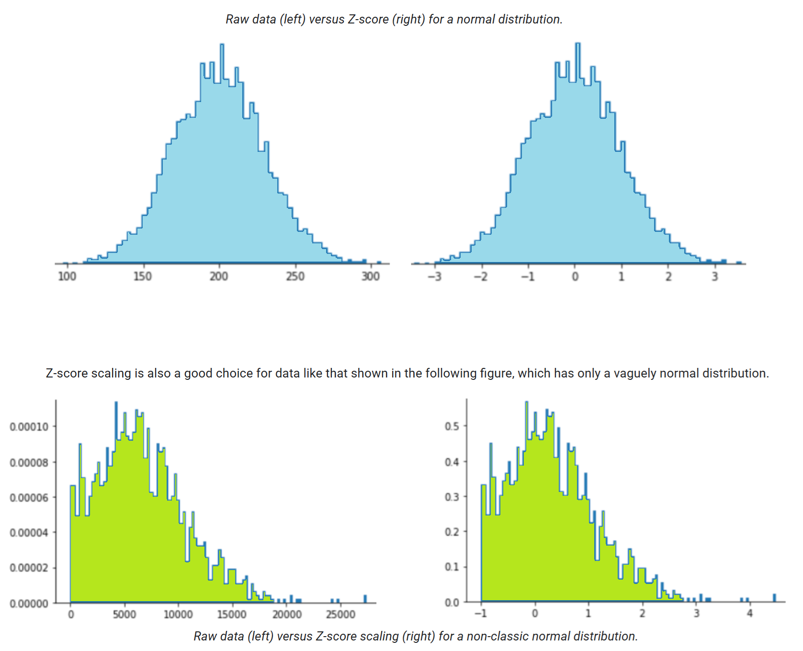

In a classic normal distribution:

- At least $68.27\%$ of data has a Z-score between $-1.0$ and $+1.0$
- At least $95.45\%$ of data has a Z-score between $-2.0$ and $+2.0$
- At least $99.73\%$ of data has a Z-score between $-3.0$ and $+3.0$
- At least $99.994\%$  of data has a Z-score between $-4.0$ and $+4.0$

*So, data points with a Z-score less than $-4.0$ or more than $+4.0$ are rare, but are they truly outliers?*

Since outliers is a concept without a strict definition, no one can say for sure. A dataset with a sufficiently large number of examples will almost certainly contain at least a few of these "rare" examples. For example, a feature with one billion examples conforming to a classic normal distribution could have as many as $60000$ examples with a score outside the range $-4.0$ to $+4.0$.

#### ➽ Examples of Z-Score Calculation

:::tip[Simple Example]

Consider a dataset of exam scores with a mean $μ$ of $75$ and a standard deviation $σ$ of $8$.

| Student       | Score | Z-Score                    |
|---------------|-------|----------------------------|
| Daniele       | $83$  | $Z = (83 - 75) / 8 = 1.0$  |
| Federico      | $75$  | $Z = (75 - 75) / 8 = 0.0$  |
| Andrea        | $59$  | $Z = (59 - 75) / 8 = -2.0$ |

**Interpretation**

- Daniele scored 1 standard deviation above the mean
- Federico scored exactly at the mean
- Andrea scored 2 standard deviations below the mean

:::

:::tip[Real World Example]

A manufacturing process produces bolts with a target diameter of $10$ mm. The production has a mean diameter $μ$ of $10.1$ mm with a standard deviation $σ$ of $0.2$ mm.

Quality control needs to flag any bolts that exceed $±2$ standard deviations.

Calculate Z-scores for the following bolt diameters:

- Bolt 1: $10.5$  
$Z = (10.5 - 10.1) / 0.2 = 2.0$

- Bolt 2: $9.8$  
$Z = (9.8 - 10.1) / 0.2 = -1.5$

- Bolt 3: $9.6$  
$Z = (9.6 - 10.1) / 0.2 = -2.5$

**Interpretation**

- Bolt 1 is exactly at the upper quality control limit ($Z = 2.0$)
- Bolt 2 is within acceptable range ($Z = -1.5$)
- Bolt 3 exceeds the lower quality control limit ($Z = -2.5$) and should be rejected

:::

#### ➽ Applications of Z-Scores

Z-scores have numerous practical applications across various fields:

- **Data Standardization**  
Z-scores convert data from different scales into a common standardized scale, making it possible to compare and analyze variables measured in different units.  
*Example: comparing a student's performance across different subjects like mathematics (measured in points) and running speed (measured in seconds).*

- **Normalization in Machine Learning**  
Z-score normalization (standardization) is a common preprocessing step that improves the performance of many machine learning algorithms.  
*Example: Before training a neural network, features like income (measured in thousands) and age (measured in years) are standardized to prevent the larger-scale feature from dominating the model.*

- **Outlier Detection**  
Z-scores help identify unusual values that may represent errors or special cases requiring attention.  
*Example: In fraud detection, banking transactions with Z-scores beyond ±3 might trigger additional verification.*

- **Probability Calculations**  
In a normal distribution, Z-scores can be directly mapped to probabilities using standard normal distribution tables.  
*Example: A Z-score of 1.96 corresponds to the 97.5th percentile, commonly used to establish 95% confidence intervals.*

#### ➽ Limitations of Z-Scores

Despite their utility, Z-scores have several limitations:

- **Assumption of normality**  
Z-scores are most interpretable in normally distributed data

- **Sensitivity to outliers**  
Both the mean and standard deviation used in Z-score calculations are affected by extreme values

- **Population parameters**  
In many cases, the true population mean and standard deviation are unknown, requiring the use of sample statistics

- **Small samples**  
Z-scores may be less reliable when calculated from small sample sizes

#### ➽ Conclusion

Z-scores represent a fundamental statistical tool that transforms raw data into standardized units, facilitating meaningful comparisons and analyses. By expressing values in terms of standard deviations from the mean, Z-scores provide a universal language for understanding data variation across different contexts and applications. Their simplicity and interpretability make them essential for both basic and advanced statistical analyses in research, business, education, and many other domains.

#### ➽ Code Snippet

```python
# Calculate the Z-scores of each numerical column in the raw data

# obtain mean and std of each numerical feature
feature_mean = rice_dataset.mean(numeric_only=True)
feature_std = rice_dataset.std(numeric_only=True)

# obtain Z-scores
numerical_features = rice_dataset.select_dtypes('number').columns
normalized_dataset = (
    rice_dataset[numerical_features] - feature_mean
) / feature_std
```

### 3. Log Scaling

#### ➽ Introduction

:::info[Definition]

Log scaling computes the logarithm of the raw value.

:::

In theory, the logarithm could be any base; in practice, log scaling usually calculates the natural logarithm $(ln)$.

#### ➽ Formula

We can use the following formula to normalize a value, $x$, to its log:

$$
x' = ln(x)
$$

#### ➽ Examples of Linear Scaling Calculation

:::tip[Example]

Sample: $54.598$

Normalized Sample: $ln(54.598) = 4.0$

:::

#### ➽ When to use

Log scaling is helpful when the data conforms to a **power law distribution**. Casually speaking, a power law distribution looks as follows:

- Low values of $X$ have very high values of $Y$
- As the values of $X$ increase, the values of $Y$ quickly decrease.  
Consequently, high values of $X$ have very low values of $Y$

:::tip[Movie Ratings]

Movie ratings are a good example of a power law distribution. In the following figure, notice:

- A few movies have lots of user ratings
- Most movies have very few user ratings

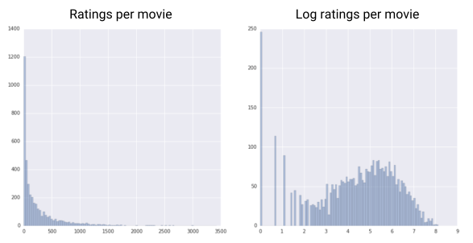

Log scaling changes the distribution, which helps train a model that will make better predictions.

:::

### 4. Clipping

#### ➽ Introduction

:::info[Definition]

Clipping is a technique used to **minimize the influence of extreme outliers**.

:::

In brief, clipping usually caps (reduces) the value of outliers to a specific maximum value. Clipping is a strange idea, and yet, it can be very effective.

#### ➽ Formula

$$\text{If } x > max \text{, set } x' = max$$

$$\text{If } x < min \text{, set } x' = min$$

#### ➽ Examples of Clipping

:::tip[roomsPerPerson]

We have a dataset containing a feature named `roomsPerPerson`, which represents the number of rooms (total rooms divided by number of occupants) for various houses.

The following plot shows that over $99\%$ of the feature values conform to a normal distribution (roughly, a mean of $1.8$ and a standard deviation of $0.7$).

However, the feature contains a few outliers, some of them extreme:

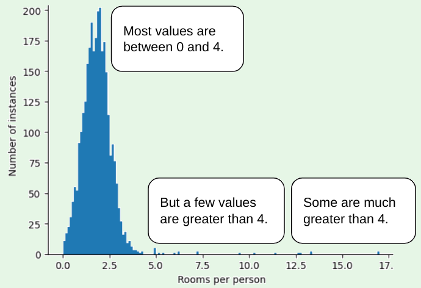

*How can we minimize the influence of those extreme outliers?*

Well, the histogram is not an even distribution, a normal distribution, or a power law distribution. What if we simply cap or clip the maximum value of `roomsPerPerson` at an arbitrary value, say $4.0$?

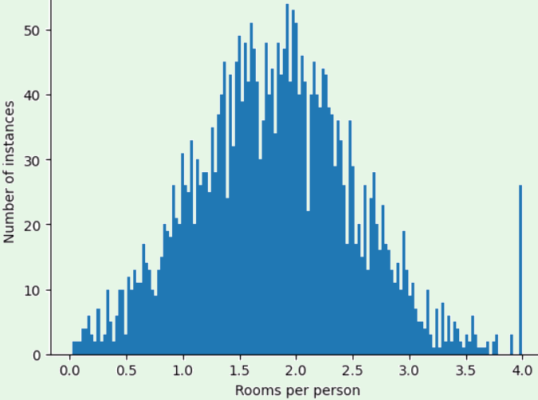

Clipping the feature value at $4.0$ doesn't mean that our model ignores all values greater than $4.0$. Rather, it means that all values that were greater than $4.0$ now become $4.0$. This explains the *peculiar hill* at $4.0$.

Despite that hill, the scaled feature set is now more useful than the original data.

:::

### Summary of normalization techniques

The following table provides a clean representation of the normalization techniques, their formulas, and when to use them.

| Normalization Technique | Formula                                                               | When to Use                                                                 |
|-------------------------|-----------------------------------------------------------------------|-----------------------------------------------------------------------------|
| Linear scaling          | $$ x' = \frac{x - x_{min}}{x_{\text{max}} - x_{min}} $$ | When the feature is uniformly distributed across a fixed range.             |
| Z-score scaling         | $$ x' = \frac{x - \mu}{\sigma} $$                                     | When the feature distribution does not contain extreme outliers.            |
| Log scaling             | $$ x' = \log(x) $$                                                    | When the feature conforms to the power law.                                 |
| Clipping                | If $$ x > max $$, set $$ x' = max $$; If $$ x < min $$, set $$ x' = min $$ | When the feature contains extreme outliers. |

### Normalization vs Standardization

There's a significant difference between normalization and standardization, though both are scaling techniques used to preprocess data for machine learning and statistical analysis.

#### ➽ Normalization (Min-Max Scaling)

Normalization scales data to a fixed range, typically $[0,1]$ or $[-1,1]$.

#### ➽ Standardization (Z-score normalization)

Standardization transforms data to have a mean of $0$ and a standard deviation of $1$. This is what we discussed with Z-scores.

## 4️⃣ **Binning**

### Introduction and Examples

:::info[Definition]

**Binning** (also called **bucketing**) is a feature engineering technique that groups different numerical subranges into bins or buckets.

:::

In many cases, binning turns numerical data into *categorical data*.

:::tip[Example]

Suppose we have a feature `X`, that goes from $15$ to $425$.

Using binning, we could represent `X` with 5 different bins:

| Bin | Values       |
|-----|--------------|
| Bin 1   | $15$ to $34$   |
| Bin 2   | $35$ to $117$  |
| Bin 3   | $118$ to $279$ |
| Bin 4   | $280$ to $392$ |
| Bin 5   | $393$ to $425$ |

The feature vector represents the five bins as follows:

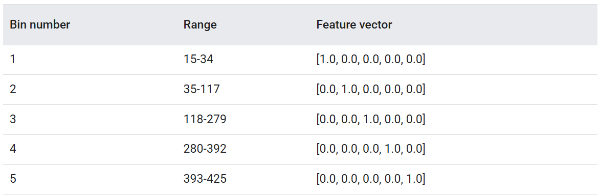

:::

Binning is a good alternative to scaling or clipping when either of the following conditions is met:

- The overall *linear* relationship between the feature and the label is **weak** or **nonexistent**.
- When the feature values are **clustered**.

When a feature appears more *clumpy* than linear, binning is a much better way to represent the data.

:::info[Clumpy]

When we say that a feature is **clumpy**, we are referring to the phenomenon where the data points for that feature are concentrated or **clustered** into distinct groups or regions rather than being evenly spread out or following a smooth, linear progression.

For example, if you have a feature that represents `age`, and the ages are mostly clustered into a few specific ranges (e.g., many people are in their 20s, many are in their 40s, and few are in between), the data would be considered clumpy. This is in contrast to a feature where the values increase smoothly or linearly, such as a feature that represents a continuous variable like `temperature`, where values might spread evenly across a range.

:::

Let's analyse another example.

:::tip[number of shoppers versus temperature]

<br></br>

#### ➽ Objective

Creating a model that predicts the number of shoppers by the outside temperature for that day.

#### ➽ Data Visualization

A scatter plot depicting the relationship between temperature and number of shoppers, consisting of 45 data points.

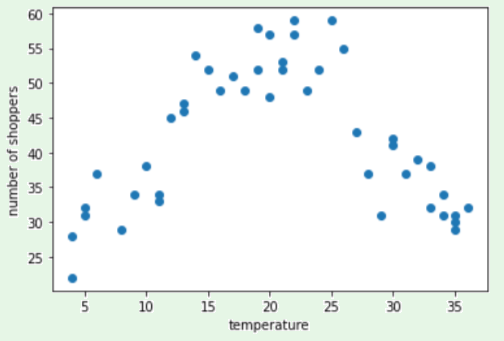

#### ➽ Key Observations

The plot reveals a non-linear relationship between temperature and shopper numbers, with the highest shopper counts occurring at moderate temperatures.

#### ➽ Raw Temperature Values

Representing temperature as raw values (e.g., $35.0$ as $35.0$ in the feature vector) presents several problematic implications.

- Linear regression assigns a single weight to each feature
- A temperature of $35.0$ would have disproportionate influence compared to $7.0$
- The actual relationship between temperature and shoppers is not linear

#### ➽ Proposed Solution: Binning

To address the non-linear relationship, the data can be binned into meaningful temperature ranges:

| Bin | Temperature Range | Characteristics |
|-----|------------------|-----------------|
| Bin 1 | 4-11°C | Low temperatures |
| Bin 2 | 12-26°C | Moderate temperatures |
| Bin 3 | 27-36°C | High temperatures |

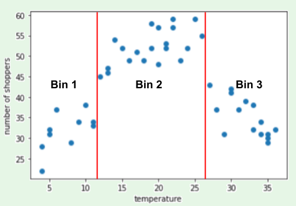

#### ➽ Model Learning Dynamics

The model learns **separate weights** for each temperature bin. Bin selection is crucial for effective model training.

#### ➽ Risks of Excessive Binning

Creating too many bins can severely compromise model performance.

In the current example, each of the 3 bins contains at least 10 examples, which *might* be sufficient for training. With 33 separate bins, each bin would likely have too few examples to learn meaningful associations.

#### ➽ Feature Proliferation

- Creating a separate bin for each temperature reading would result in 33 distinct temperature features
- Machine learning principles recommend *minimizing* the number of features in a model
- More features can lead to:
  - Overfitting
  - Increased computational complexity
  - Reduced model generalizability

:::

### Quantile Bucketing

:::info[Definition]

**Quantile bucketing** is a data binning technique that creates bucket boundaries to ensure each bucket contains approximately the same number of examples. This method is particularly useful for handling **skewed data** distributions.

:::

#### ➽ The Problem with Equal Interval Bucketing

Consider a scenario with `car price` data divided into equally spaced buckets of $10,000$ $ each.

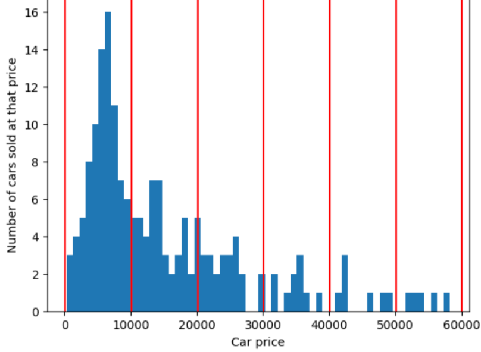

- The bucket from $0$ to $10,000$ might contain dozens of examples
- The bucket from $50,000$ to $60,000$ might contain only 5 examples

This uneven distribution creates a significant challenge for machine learning models:

- Some buckets have abundant training data
- Other buckets have insufficient data for meaningful learning

#### ➽ How Quantile Bucketing Works

In contrast to equal interval bucketing, quantile bucketing:

- Divides data into bins with approximately equal number of examples
- Allows bucket width to vary significantly
- Some bins may cover a narrow price range
- Other bins may span a much wider price range

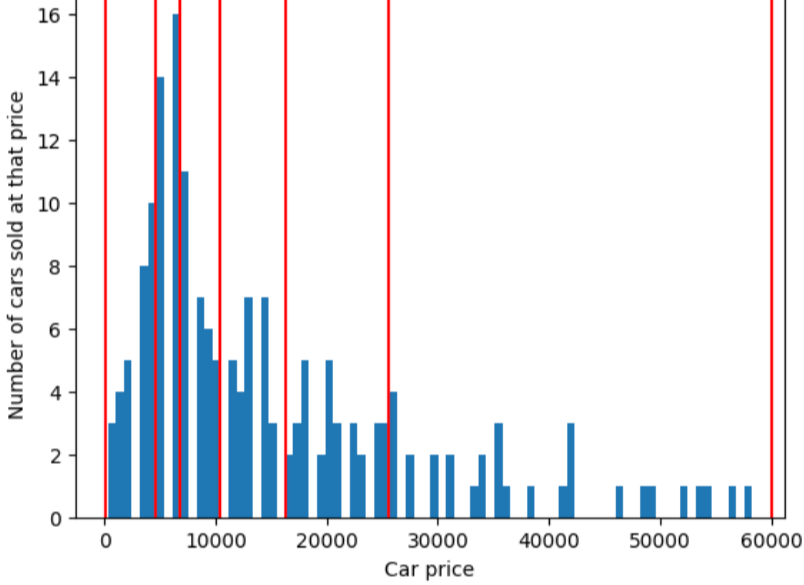

#### ➽ Advantages for Skewed Data

Quantile bucketing is particularly effective for skewed data distributions:

- Equal intervals give disproportionate space to the long tail of the distribution
- Quantile bucketing compresses the long tail while expanding the information space for the main body of data

#### ➽ Key Benefits

- Ensures more balanced representation of data
- Reduces the impact of outliers
- Provides more consistent learning opportunities across different data ranges

#### ➽ When to Use

- Recommended for datasets with uneven distributions
- Particularly useful for skewed or highly variable data

## 5️⃣ **Scrubbing**

### Premises

ML engineers spend enormous amounts of time tossing out bad examples and cleaning up the salvageable ones. Remember: just a few bad apples can spoil a large dataset.

Many examples in datasets are unreliable due to one or more of the following problems:

| Problem Category            | Example |
|-----------------------------|------------------|
| Omitted values              | A census taker fails to record a resident's age. |
| Duplicate examples          | A server uploads the same logs twice. |
| Out-of-range feature values | A human accidentally types an extra digit. |
| Bad labels                  | A human evaluator mislabels a picture of an oak tree as a maple. |

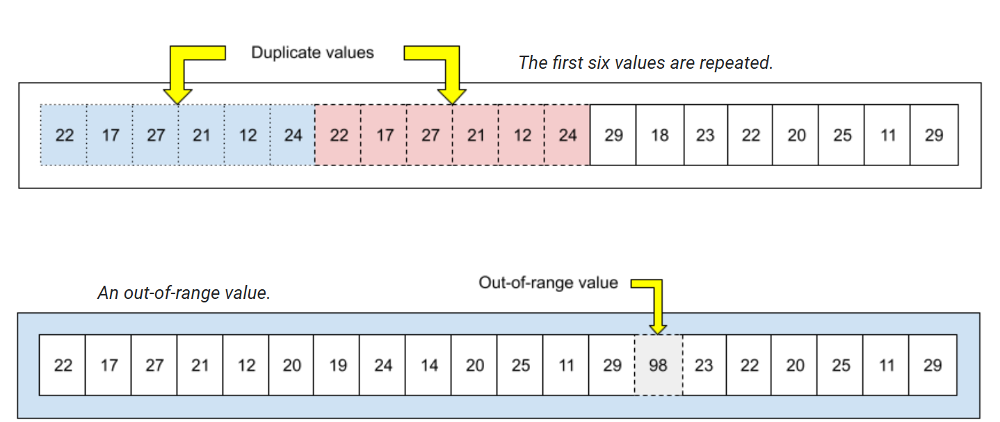

### What can we do?

We can write a program or script to detect any of the following problems:

- Omitted values
- Duplicate examples
- Out-of-range feature values

Once detected, we typically "fix" examples that contain bad features or bad labels by removing them from the dataset or imputing their values.

## 6️⃣ **Qualities of good numerical features**

Good numerical features share the qualities described in the following table.

| Principle | Not Recommended | Recommended | Explanation |
|-----------|-----------------|-------------|--------------|
| *Clearly Named* | `house_age: 851472000` | `house_age_years: 27` | Feature names should have an obvious, human-readable meaning. The recommended version immediately communicates the feature's unit and intent. |
| *Checked/Tested* | `user_age_in_years: 224` | `user_age_in_years: 24` | Validate data to ensure it contains sensible, realistic values. Always check your data sources for accuracy and appropriate ranges. |
| *Sensible Representation* | `watch_time_in_seconds:-1` | `watch_time_in_seconds:4.82`<br></br>`is_watch_time_defined:True` <br></br> or <br></br> `watch_time_in_seconds:0.0`<br></br>`is_watch_time_defined:False` | Avoid "magic values" that introduce artificial discontinuities. Instead, use separate boolean flags or explicit missing value representations. |
| *Discrete Feature Handling* | (Implied missing handling) | Create a specific value to represent missing data within the finite set | For discrete features, introduce a distinct value to represent missing data, allowing the model to learn weights for missing feature states. |

:::warning[Note]

While human collaborators will appreciate clear feature names, machine learning models are **agnostic to naming**; they care about proper normalization and meaningful representations.

:::

## 7️⃣ **Polynomial transforms**

### Motivation for Synthetic Features

Sometimes, when an ML practitioner has domain knowledge suggesting that one variable is related to the square, cube, or other power of another variable, creating a **synthetic feature** from an existing numerical feature can be beneficial.

:::tip[Nonlinear Separation Example]

Consider a dataset with two classes (e.g., different species of trees) represented by:

- Pink circles: First class
- Green triangles: Second class

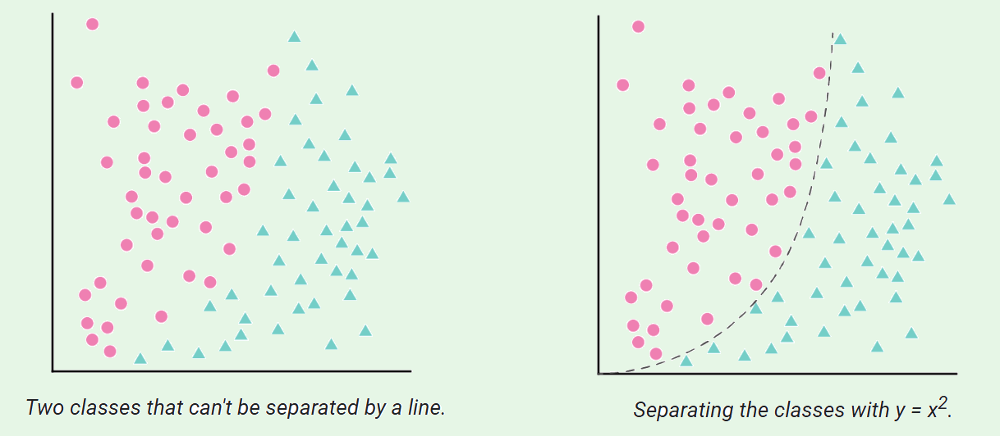

While a linear separator fails, a nonlinear transformation can successfully distinguish between the classes.

:::

### Polynomial Transform

#### ➽ Linear Model Basics

In a standard linear regression model with one feature $x₁$, the equation is:
$y = b + w₁x₁$

With multiple features, additional terms are added:
$y = b + w₁x₁ + w₂x₂ + w₃x₃$

**Gradient descent** finds the weights $(w₁, w₂, w₃)$ that minimize the model's loss.

#### ➽ Handle nonlinearity

When data points cannot be separated linearly, you can introduce nonlinearity by **creating a synthetic feature**.

Define a new feature $x₂$ as the square of $x₁$: $x₂ = x₁²$

The modified linear equation becomes:
$y = b + w₁x₁ + w₂x₂$

#### ➽ Key insights

- This remains a linear regression problem
- Gradient descent can still determine weights
- The model can now separate data using a curve ($y = b + w₁x + w₂x²$)

#### ➽ Choosing Polynomial Transforms

Most often, numerical features are raised to a power (typically squared). Domain knowledge can guide the choice of exponent.

:::tip[Examples of Squared-Term Relationships]

- Acceleration due to gravity
- Light or sound attenuation over distance
- Elastic potential energy

:::
