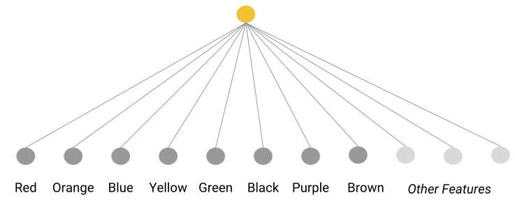
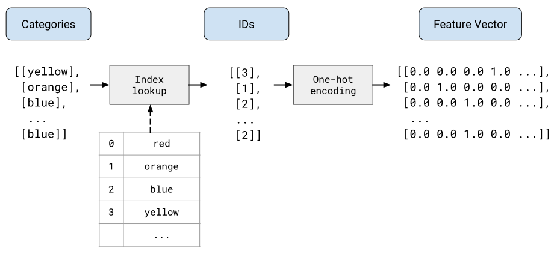

## ➡️ **Useful Materials**

### Original Source

You can find here the original course: [**Working with Categorical Data**](https://developers.google.com/machine-learning/crash-course/categorical-data)

## 1️⃣ **Introduction**

### Definition and Example

:::info[Definition]

Categorical Data: features having a **specific set of possible values**.

:::

:::tip[Traffic Light State]

For example, consider a categorical feature named `traffic-light-state`, which can only have one of the following three possible values:

- red
- yellow
- green

By representing `traffic-light-state` as a categorical feature, a model can learn the differing impacts of red, green, and yellow on driver behavior.

Categorical features are sometimes called **discrete features**.

:::

### Numbers can also be categorical data

#### ➽ Characteristics of True Numerical Data

**Numerical data** that can be meaningfully multiplied represents quantitative attributes with inherent mathematical relationships.

A prime example is `area` in real estate valuation:

- In a house pricing model, `area` demonstrates a clear numerical relationship where size directly correlates with `value`.
- A house of 200 square meters can be reasonably expected to be approximately twice as valuable as an identical house of 100 square meters.
- Complex pricing models typically incorporate hundreds of features to capture nuanced value determinants.

#### ➽ Categorical vs. Numerical Feature Representation

Not all integer-valued features should be treated as numerical data.

Consider **postal codes** as a critical example:

- Representing postal codes numerically introduces misleading mathematical interpretations.
- A numeric representation suggests inappropriate relationships between codes, such as treating postal code 20004 as mathematically related to 10002.
- By contrast, categorical representation allows the model to assign independent significance to each unique postal code.

#### ➽ Best Practice: Choose Representation Wisely

Select feature representation based on the inherent mathematical meaning of the data:

- Use numerical representation for attributes with genuine multiplicative or proportional relationships
- Use categorical representation for identifiers, codes, or values without intrinsic mathematical meaning

### Encoding

:::info[Definition]

**Encoding** is a critical preprocessing technique that transforms categorical or non-numerical data into numerical vectors suitable for machine learning model training.

:::

This conversion is essential because:

- Machine learning models fundamentally operate on floating-point numerical values
- Raw categorical data like strings (`"dog"`, `"maple"`) cannot be directly processed by most algorithms
- Encoding bridges the gap between human-readable categorical data and machine-readable numerical representations

## 2️⃣ **Vocabulary and one-hot encoding**

### Categorical Data

Categorical data refers to features that can take on a limited, fixed number of values, each representing a specific category or class. These values are often non-numeric, and the categories are distinct from one another.

For example:

- `snowed_today`  
A binary categorical feature with two categories: `True` and `False`
- `skill_level`  
A categorical feature with three levels: `Beginner`, `Practitioner`, and `Expert`
- `season`  
A categorical feature representing the four seasons: `Winter`, `Spring`, `summer`, and `Autumn`
- `day_of_week`  
A feature with seven categories, representing the days of the week
- `planet`  
A categorical feature with eight values: `Mercury`, `Venus`, `Earth`, etc

### Vocabulary Encoding

When the number of categories for a categorical feature is small, a vocabulary encoding can be used. In this method, each possible category is treated as a distinct feature, and the model learns a separate weight for each category. For example, for the feature `car_color` with categories like `Red`, `Orange`, `Blue`, etc., a vocabulary is created where each color is treated as a separate feature.



### Machine Learning and Raw String Values

Machine learning models, however, do not work with raw string values. They can only process numerical values. Therefore, categorical data in the form of strings must be converted into numerical representations before they can be used in machine learning models.

### One-Hot Encoding

One-hot encoding is a common method for converting categorical data into numerical data. In a one-hot encoding:

- Each category is represented by a vector of $N$ elements, where $N$ is the total number of categories.
- Each element in the vector corresponds to one category, and only one element is marked with a $1.0$ (indicating the presence of that category), while the rest are $0.0$.

For example, the one-hot encoding for the `car_color` feature with eight possible categories might look like this:

```python
   Red: [1, 0, 0, 0, 0, 0, 0, 0]
Orange: [0, 1, 0, 0, 0, 0, 0, 0]
  Blue: [0, 0, 1, 0, 0, 0, 0, 0]
# ...
```



### Sparse Representation

One-hot encoding often results in sparse vectors, where most of the elements are zero.

:::info[Definition]

**Sparse representation** is a technique that saves memory by only storing the index of the non-zero elements.

:::

For example, instead of storing the entire one-hot vector, we can store the index where the $1.0$ is placed. For the color "Blue":

- One-hot encoding: $[0, 0, 1, 0, 0, 0, 0, 0]$
- Sparse representation: $2$ (since the non-zero element is at index 2).

This reduces memory usage and allows for more efficient computations.

### Multi-Hot Encoding

In some cases, a category may have multiple values present simultaneously (e.g., a car could have both a `Blue` and `Red` color). This requires a modification of the one-hot encoding, known as **multi-hot encoding**, where multiple positions in the vector can have a value of $1.0$ (indicating the presence of multiple categories). The sparse representation of a multi-hot encoding will store the positions of all non-zero elements.

### Example

Let’s illustrate these concepts using a practical example: predicting a car’s price based on the color of the car, where the color is a categorical feature.

:::tip[Example]

<br></br>

#### ➽ **1. Define the Categories**

The `car_color` feature has the following possible categories:

```python
values = [
   "Red",
   "Orange",
   "Blue",
   "Yellow",
   "Green",
   "Black",
   "Purple",
   "Brown"
]
```

#### ➽ **2. Vocabulary Encoding**

First, we assign a **unique index** to each category:

```python
values = [
   (0, "Red"),
   (1, "Orange"),
   (2, "Blue"),
   (3, "Yellow"),
   (4, "Green"),
   (5, "Black"),
   (6, "Purple"),
   (7, "Brown")
]
```

#### ➽ **3. One-Hot Encoding**

Next, we convert these index numbers into **one-hot encoding**.

For instance, if the car is `Blue`, it will be represented by the following one-hot vector:

```python
Blue: [0, 0, 1, 0, 0, 0, 0, 0]
```

Each element in this vector corresponds to a category in the vocabulary list. The position of $1$ indicates the car color (in this case, `Blue`).

#### ➽ **4. Sparse Representation**

Since one-hot vectors are sparse (most of their values are zero), we can use a sparse representation to store the position of the $1.0$ instead of the entire vector.

For example, the sparse representation of `Blue` would be $2$, since $1.0$ appears at index 2 in the one-hot vector.

#### ➽ **5. Multi-Hot Encoding**

Suppose a car has two colors, `Red` and `Blue`. The multi-hot encoding would look like this:

```python
Red and Blue: [1, 0, 1, 0, 0, 0, 0, 0]
```

The sparse representation would store the positions of the non-zero elements, i.e., $0, 2$.

:::

In this example, we transformed the categorical feature `car_color` into a numerical format that a machine learning model can process.

We used:

- **Vocabulary Encoding** to assign unique indices to each color.
- **One-Hot Encoding** to convert the indices into binary vectors.
- **Sparse Representation** to store the position of the non-zero element for efficiency.
- **Multi-Hot Encoding** to handle cases where multiple categories can be present simultaneously.

This step-by-step transformation enables the machine learning model to learn meaningful patterns from the categorical data.

### Outliers in categorical data

Like numerical data, categorical data also contains outliers.

Suppose `car_color` contains not only the popular colors, but also some rarely used outlier colors, such as `"Mauve"` or `"Avocado"`. Rather than giving each of these outlier colors a separate category, you can lump them into a single "catch-all" category called **out-of-vocabulary** (OOV).

In other words, all the outlier colors are binned into a single outlier bucket. The system learns a single weight for that outlier bucket.

### Encoding high-dimensional categorical features

Some categorical features have a high number of dimensions.

:::tip[Examples]

- `words_in_english`  
~500,000

- `US_postal_codes`  
~42,000

- `last_names_in_Germany`  
~850,000

:::

When the number of categories is high, one-hot encoding is usually a **bad choice**. 

**Embeddings** are usually a much better choice. They substantially reduce the number of dimensions, which benefits models in two important ways:

- The model typically trains faster.
- The built model typically infers predictions more quickly. That is, the model has lower latency.

**Hashing** is a less common way to reduce the number of dimensions.

*Note: we will explore both in future modules.*

## 3️⃣ **Common Issues**

The process of categorizing data is fundamentally different from numerical measurements. While scientific instruments can record numerical data with relative precision, categorical data emerges mostly through human interpretation or machine learning models. This human or algorithmic intervention introduces layers of complexity that significantly impact data quality and reliability.

### Human Raters: The Human Dimension of Data Labeling

Human-labeled data, often referred to as **gold labels**, occupies a privileged position in machine learning. Researchers and practitioners typically view human annotations as more trustworthy and nuanced compared to machine-generated labels. However, this perception requires careful scrutiny.

Humans are not infallible data annotators. Our cognitive processes are susceptible to numerous biases, errors, and subjective interpretations. When humans categorize data, they bring their own:

- Personal experiences
- Cultural backgrounds
- Linguistic understanding
- Cognitive biases
- Momentary emotional states

These individual variations can introduce significant inconsistencies in data labeling. This is where the concept of **inter-rater agreement** becomes crucial. By having multiple individuals label the same examples and then comparing their categorizations, researchers can quantify the variance in human judgment.

:::info[inter-rater agreement]

A measurement of how often human raters agree when doing a task. If raters disagree, the task instructions may need to be improved. Also sometimes called inter-annotator agreement or inter-rater reliability.

:::

### Machine Raters: The Silver Label Challenge

Machine-generated labels, or **silver labels**, present their own set of intricate challenges. Unlike human raters, machine learning models derive categories through computational processes that can be both impressively accurate and surprisingly naive.

Consider a computer vision model that might:

- Misclassify a chihuahua as a muffin
- Confuse a neutral sentiment with a slightly negative one
- Overzealously flag neutral statements as toxic

These seemingly absurd misclassifications reveal fundamental limitations in machine learning models. They underscore the importance of rigorous validation and bias detection before using such labels for training.

### The Dimensionality Dilemma

Categorical data introduces a significant technical challenge: **high dimensionality**. Each unique category potentially represents a new dimension in the feature space, rapidly increasing computational complexity.

For natural language processing, **embedding** techniques offer an elegant solution. By transforming high-dimensional categorical representations into dense, lower-dimensional vector spaces, researchers can dramatically reduce computational overhead while preserving semantic relationships.

### Key Takeaways

Understanding the nuances of categorical data labeling is not just a technical exercise, it's about recognizing the profound human and algorithmic factors that shape our machine learning models. Careful, critical evaluation of labeling processes is essential for developing reliable, unbiased AI systems.

## 4️⃣ **Feature Crosses**

*Unlocking Nonlinear Relationships in Categorical Data*

Machine learning often grapples with the challenge of capturing complex, nonlinear relationships between features. Linear models, while computationally efficient, struggle to represent intricate interactions. This is where feature crosses emerge as a powerful technique for expanding a model's ability to understand nuanced patterns.

### The Essence of Feature Crosses

Imagine features as individual puzzle pieces that only tell part of a story. Feature crosses are like combining these pieces to reveal a more comprehensive picture. By taking the Cartesian product of categorical features, we create new synthetic features that capture interactions between original characteristics.

Let's dive into a concrete example from botanical classification to illustrate this concept. Consider a dataset of leaf characteristics with two categorical features:

- `edges`: describing leaf edge types (smooth, toothed, lobed)
- `arrangement`: describing how leaves attach to stems (opposite, alternate)

In a traditional one-hot encoded representation, a leaf might be represented as separate binary indicators for its edge type and arrangement. A feature cross transforms this into a more sophisticated representation that captures the specific combination of these traits.

### How Feature Crosses Work

The magic of feature crosses lies in their ability to create new features that represent the intersection of original features. For our leaf example, a feature cross would generate combinations like:

- `Smooth_Opposite`
- `Smooth_Alternate`
- `Toothed_Opposite`
- `Toothed_Alternate`
- `Lobed_Opposite`
- `Lobed_Alternate`

Each of these new features will have a value of $1$ only when both original features match their specific categories. This allows a linear model to capture nonlinear relationships that would otherwise be invisible.

### Computational Considerations

While powerful, feature crosses come with computational trade-offs. Crossing sparse features can lead to exponential growth in feature dimensionality. A feature with 100 elements crossed with a 200-element feature results in a 20,000-element feature space. This computational explosion necessitates careful consideration and potential dimensionality reduction techniques.

### Strategic Application

Determining effective feature crosses isn't always straightforward. Domain expertise plays a crucial role in identifying meaningful feature interactions. When human insight falls short, modern machine learning techniques offer alternative approaches:

- Neural networks can automatically discover and learn feature interactions
- Automated feature engineering tools can help identify promising feature combinations
- Dimensionality reduction techniques can mitigate computational challenges

### Comparison with Polynomial Transforms

Feature crosses share conceptual DNA with polynomial transforms. Both techniques aim to help linear models capture nonlinear relationships. The key difference lies in their typical input: feature crosses primarily work with categorical data, while polynomial transforms traditionally operate on numerical features.

### Key Insights

Feature crosses represent more than a mere technical trick: they're a bridge between linear models and the complex, interconnected nature of real-world data. By understanding and strategically applying feature crosses, data scientists can unlock deeper insights and build more nuanced predictive models.
