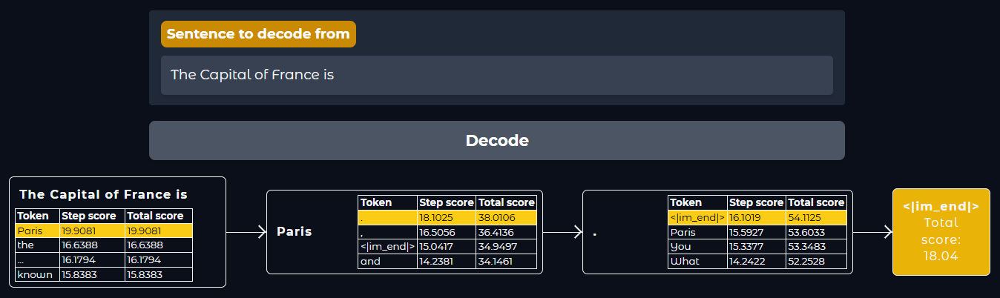
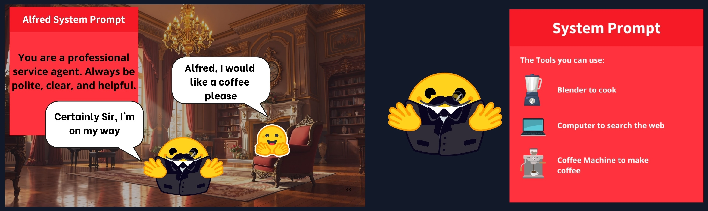
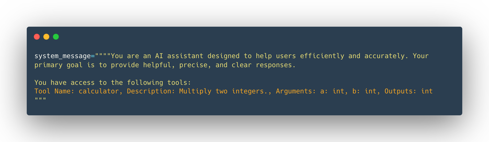
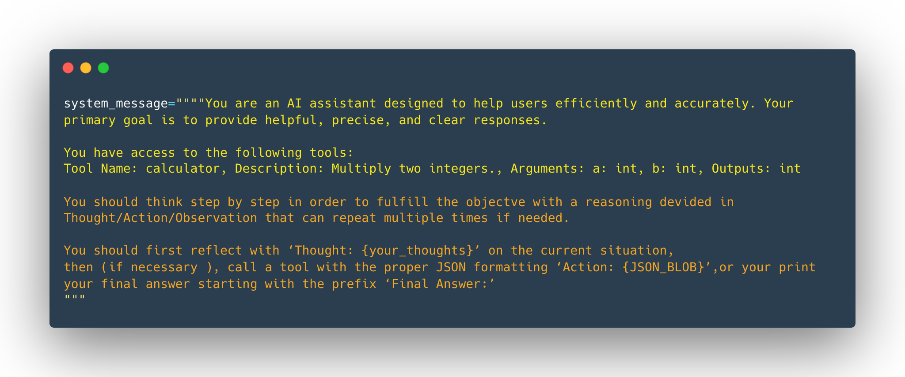
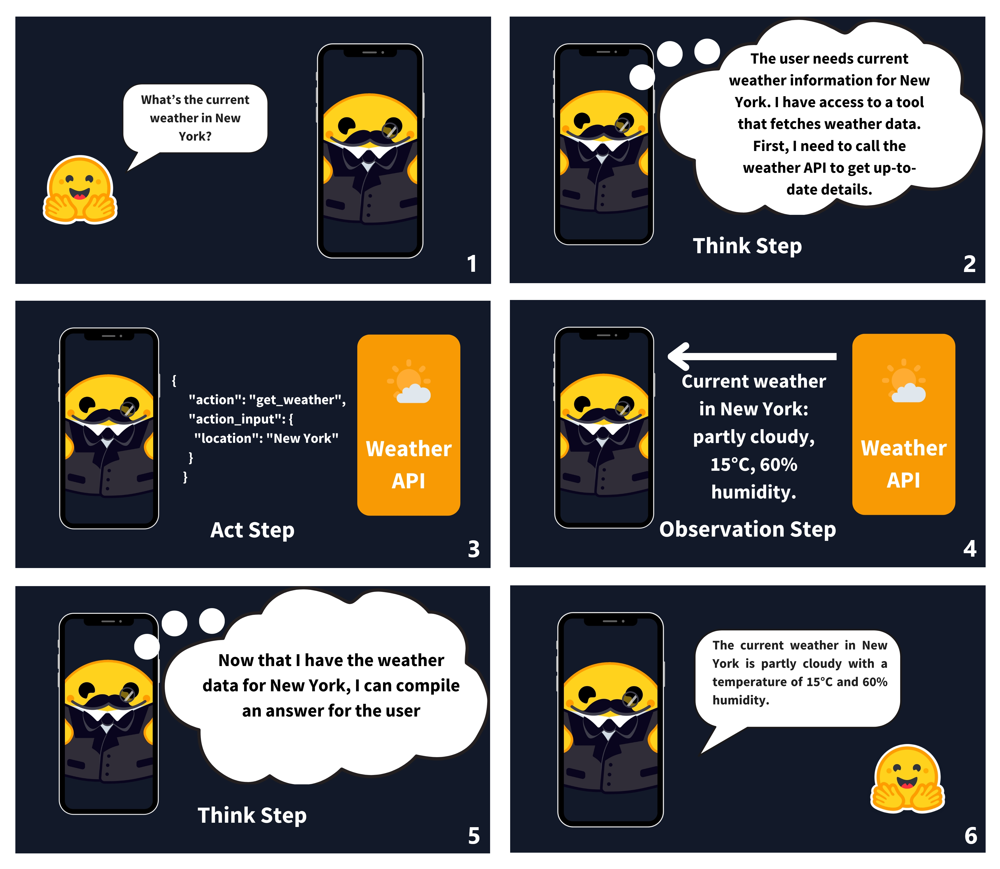
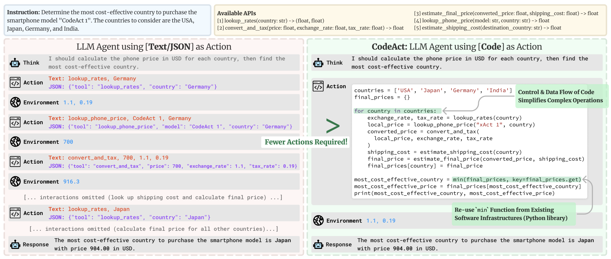

# Unit 1. Introduction to Agents

## ➡️ **Useful Materials**

### Original Source

You can find here the original [**HuggingFace Unit 1**](https://huggingface.co/learn/agents-course/unit1/what-are-agents).

## 1️⃣ **What is an agent?**

### Definitions

:::info[Intuitive Definition]

AI model capable of *reasoning*, *planning*, and *interacting with its environment*.

We call it Agent because it has agency, aka it has the ability to interact with the environment.

:::

:::info[Formal Definition]

An Agent is a system that leverages an AI model to interact with its environment in order to achieve a user-defined objective. It combines reasoning, planning, and the execution of actions (often via external tools) to fulfill tasks.

:::

We can think of the Agent as having two main parts:

- **The Brain (AI Model)**

    This is where all the thinking happens. The AI model handles reasoning and planning. It decides which Actions to take based on the situation.

- **The Body (Capabilities and Tools)**

    This part represents everything the Agent is equipped to do.

The scope of possible actions depends on what the agent has been equipped with. For example, because humans lack wings, they can't perform the “fly” Action, but they can execute Actions like “walk”, “run” ,“jump”, “grab”, and so on.

### What type of AI Models do we use for Agents?

The most common AI model found in Agents is an LLM (Large Language Model), which takes **Text** as an input and outputs **Text** as well.

### Tasks an Agent Can Perform

An **Agent** can execute any task by leveraging **Tools** to carry out **Actions**.

#### Example: Personal Assistant

If an Agent acts as a personal assistant (like Siri), it can send an email when instructed. This requires a **Tool**, such as a Python function:

```python
def send_message_to(recipient, message):
    """Useful to send an e-mail message to a recipient"""
    ...
```

When prompted, the **LLM** generates code to invoke the tool:

```python
send_message_to("Manager", "Can we postpone today's meeting?")
```

#### Importance of Tools

- **Well-designed Tools** significantly impact an Agent's effectiveness.
- Some tasks need **specific Tools**, while others can use **general-purpose** ones (e.g., `web_search`).

#### Actions vs. Tools

- **Tools** are functions the Agent can use.
- **Actions** may involve multiple **Tools** to complete a task.

### Summary

An **Agent** is a system that leverages an **AI Model** (typically an LLM) as its core reasoning engine to:

- **Understand natural language** – Interpret and respond to human instructions meaningfully.
- **Reason and plan** – Analyze information, make decisions, and devise strategies.
- **Interact with its environment** – Gather information, take actions, and observe outcomes.

## 2️⃣ **What are LLMs?**

### What is a Large Language Model (LLM)?

:::info[Definition]

An **LLM** is an AI model specialized in understanding and generating human language. It learns linguistic patterns, structure, and nuances by training on vast amounts of text data.

:::

Key Characteristics:

- Consists of **millions** (or more) **parameters**.
- Built on the **Transformer** architecture, leveraging the **Attention** mechanism.
- Gained prominence with models like **BERT** (Google, 2018).

### Types of Transformers

There are three main types of **Transformer** architectures:

#### 1. **Encoders**

- *Function:* Convert input text into a dense representation (embedding).
- *Example:* **BERT** (Google)
- *Use Cases:* Text classification, semantic search, Named Entity Recognition (NER)
- *Typical Size:* **Millions** of parameters

#### 2. **Decoders**

- *Function:* Generate tokens sequentially to complete a text.
- *Example:* **Llama** (Meta)
- *Use Cases:* Text generation, chatbots, code generation
- *Typical Size:* **Billions** of parameters

#### 3. **Seq2Seq (Encoder–Decoder)**

- *Function:* Encodes input into a context representation, then decodes it into an output sequence.
- *Examples:* **T5, BART**
- *Use Cases:* Translation, summarization, paraphrasing
- *Typical Size:* **Millions** of parameters

### Notable LLMs

Most **LLMs** are **decoder-based models** with **billions** of parameters.

| Model       | Provider              |
|------------|-----------------------|
| **Deepseek-R1** | DeepSeek |
| **GPT-4**  | OpenAI  |
| **Llama 3**  | Meta |
| **SmolLM2**  | Hugging Face  |
| **Gemma**  | Google  |
| **Mistral**  | Mistral  |

### How LLMs Work

The core mechanism of an **LLM** is **next-token prediction**:

- Given a sequence of tokens, the model predicts the most probable **next token**.
- A **token** is a fundamental unit of text, often smaller than a word.

#### Tokenization Example

- Instead of full words, LLMs use sub-word units for efficiency.
- Example:
  - `"interest"` + `"ing"` → `"interesting"`
  - `"interest"` + `"ed"` → `"interested"`
- Some LLMs, like **Llama 2**, have vocabularies of around **32,000 tokens** (compared to 600,000 words in English).

#### Special Tokens in LLMs

LLMs use **special tokens** to structure input and output, marking elements like **sequence boundaries** and **message turns**. The most crucial is the **End of Sequence (EOS) token**.

### Understanding Next-Token Prediction

LLMs are **autoregressive**, meaning that the **output of one step** becomes the **input for the next**. This loop continues **until** the model predicts the **EOS (End of Sequence) token**, signaling completion.

#### How a Single Decoding Loop Works:

1. **Tokenization** – The input text is split into **tokens**.
2. **Representation Computation** – The model assigns each token a representation that encodes **meaning** and **position** in the sequence.
3. **Next-Token Prediction** – The model calculates scores for **all possible next tokens**, ranking them by likelihood.
4. **Token Selection** – A decoding strategy determines the next token.

#### Decoding Strategies:

- **Greedy Decoding** – Always selects the **highest-scoring token** at each step.
- **Beam Search** – Considers **multiple candidate sequences**, optimizing for the **best overall sequence** rather than just the highest individual token scores.

LLMs keep generating tokens **until** the EOS token (e.g., `<|im_end|>` in some models) is reached.




### Attention is All You Need

A **key feature** of the Transformer architecture is **Attention**, which allows the model to focus on the most relevant words when predicting the next token.

#### How Attention Works

- Not all words contribute equally to understanding a sentence.
- Example: In **"The capital of France is …"**, the words **"France"** and **"capital"** are crucial for predicting the next token.
- The **Attention mechanism** identifies these key words, making LLMs highly effective.

#### Advancements in Attention & Scaling

- While **next-token prediction** remains the core principle (since **GPT-2**), improvements in **scaling** and **longer attention spans** have enhanced LLMs.
- **Context length** refers to the **maximum number of tokens** the model can process at once—determining how much prior information it can use when generating text.


### Prompting the LLM

Since an **LLM's** sole function is **predicting the next token** while determining **which tokens are important**, the way you phrase your **prompt** significantly impacts the output. **Careful prompt design** helps steer the model toward the desired result.

### How LLMs Are Trained

1. **Pre-training**
   - LLMs learn by predicting the next word in massive text datasets.
   - This process is **self-supervised** (or **masked language modeling** for some models).
   - The model generalizes language structures and patterns.

2. **Fine-tuning**
   - After pre-training, models can be adapted for specific tasks using **supervised learning**.
   - Example fine-tuned models:
     - Conversational AI (e.g., chatbots)
     - Code generation
     - Classification

### How to Use LLMs

1. **Run Locally** – Requires high-performance hardware.
2. **Use a Cloud/API** – Access via services like **Hugging Face Serverless Inference API**.

This course primarily uses **API-based models**, but later covers running models on local hardware.

### LLMs in AI Agents

LLMs serve as the **brain** of an **AI Agent**, enabling it to:

- Interpret user instructions.
- Maintain conversation context.
- Define a plan.
- Decide which tools to use.

## 3️⃣ **Messages and Special Tokens**

### Messages and Special Tokens

#### How LLMs Handle Conversations

While **chat interfaces** (like ChatGPT or HuggingChat) present interactions as a sequence of messages, **LLMs do not inherently "remember" past exchanges**. Instead, all messages are:

1. **Concatenated** into a single **prompt** before being sent to the model.
2. **Reprocessed in full** with every new interaction.

### Chat Templates & Special Tokens

Since different LLMs use different formatting rules, **chat templates** standardize the structure of user-assistant interactions. They:

- Convert conversational **messages** into a **formatted prompt**.
- Ensure **special tokens** (used to mark user and assistant turns) are applied correctly.

Each model has its own unique **EOS (End of Sequence) token** and message **delimiters**, which influence how conversations are structured internally.

### Messages: The Underlying System of LLMs

#### System Messages (System Prompts)

System messages define **how the model should behave** by providing persistent instructions that guide every interaction.

**Example:**

```python
system_message = {
    "role": "system",
    "content": "You are a professional customer service agent. Always be polite, clear, and helpful."
}
```

#### System Messages in Agents

In **AI Agents**, system messages also:

- Describe **available tools**.
- Provide **formatting instructions** for actions.
- Define **guidelines for structuring the model's thought process**.

These instructions ensure consistency in the model's behavior and task execution.



### Conversations: User and Assistant Messages

A conversation consists of alternating messages between a **user** and an **LLM assistant**.

#### Maintaining Context with Chat Templates

Chat templates structure the conversation history into a **single prompt**, ensuring **coherent multi-turn exchanges**.

**Example Conversation in Python:**

```python
conversation = [
    {"role": "user", "content": "I need help with my order"},
    {"role": "assistant", "content": "I'd be happy to help. Could you provide your order number?"},
    {"role": "user", "content": "It's ORDER-123"},
]
```

Since LLMs do not remember past messages, all exchanges are **concatenated into a single formatted prompt** before being fed into the model.

### Chat Template Formatting Examples

Different LLMs use distinct **special tokens** and **message formats** to structure conversations.

#### SmolLM2 Chat Template

```plaintext
<|im_start|>system
You are a helpful AI assistant named SmolLM, trained by Hugging Face<|im_end|>
<|im_start|>user
I need help with my order<|im_end|>
<|im_start|>assistant
I'd be happy to help. Could you provide your order number?<|im_end|>
<|im_start|>user
It's ORDER-123<|im_end|>
<|im_start|>assistant
```

#### Llama 3.2 Chat Template

```plaintext
<|begin_of_text|><|start_header_id|>system<|end_header_id|>

Cutting Knowledge Date: December 2023
Today Date: 10 Feb 2025

<|eot_id|><|start_header_id|>user<|end_header_id|>

I need help with my order<|eot_id|><|start_header_id|>assistant<|end_header_id|>

I'd be happy to help. Could you provide your order number?<|eot_id|><|start_header_id|>user<|end_header_id|>

It's ORDER-123<|eot_id|><|start_header_id|>assistant<|end_header_id|>
```

Each model applies its **own message delimiters** and **special tokens** to ensure correct conversation formatting.

By structuring user and assistant messages properly, **LLMs can maintain context over extended conversations**.

### Base Models vs. Instruct Models

We need to understand is the difference between a Base Model vs. an Instruct Model.

| **Model Type**  | **Description**  | **Example**  |
|---------------|------------------|-------------|
| *Base Model*  | Trained on raw text to predict the next token.  | *SmolLM2-135M*  |
| *Instruct Model*  | Fine-tuned to follow instructions and engage in conversations.  | *SmolLM2-135M-Instruct*  |

#### Why Chat Templates Matter

- Base models **do not** naturally follow instructions.
- Proper **prompt formatting** helps align base models with **instruction-following behavior**.
- **Chat templates** provide a structured format that models can consistently interpret.

#### ChatML – A Standard Chat Template

ChatML is a common chat template format that labels each message with *role indicators*:

- *system* – Defines model behavior.
- *user* – Represents user input.
- *assistant* – Denotes model responses.

If an **instruct model** is fine-tuned with a specific chat template, you must ensure you use the **correct template** when interacting with it.

## 4️⃣ **What are Tools?**

### Tools

:::info[Definition]

A **Tool** is a **function** provided to an LLM to fulfill a **specific objective**.

:::

#### Common AI Tools

| **Tool**            | **Description**  |
|--------------------|----------------|
| *Web Search*     | Fetches real-time information from the internet.  |
| *Image Generation* | Creates images from text descriptions.  |
| *Retrieval*      | Retrieves data from external sources.  |
| *API Interface*  | Interacts with external APIs (e.g., GitHub, YouTube, Spotify).  |

While these are common examples, **any function can be turned into a tool** based on your needs.

#### Why Use AI Tools?

LLMs have limitations, such as:

- **Weak arithmetic skills** – A **calculator tool** is more reliable for numerical operations.
- **Limited knowledge scope** – LLMs **only know information up to their training cutoff**.
- **No real-time updates** – Without tools like **web search**, an LLM may **hallucinate** information (e.g., today's weather).

#### What Makes a Good Tool?

A **Tool** should include:

1. **A clear description** – Explains its purpose.
2. **A callable function** – Performs the action.
3. **Typed arguments** – Specifies required inputs.
4. **(Optional) Typed outputs** – Defines expected return values.

By integrating tools, *LLMs can extend their capabilities beyond text prediction*.

### How Do Tools Work?

LLMs **cannot directly call tools**, they can only process **text inputs** and generate **text outputs**. Instead, when we provide tools to an **Agent**, we:

1. **Teach the LLM** about the tool's existence.
2. **Ask the LLM** to generate text that invokes the tool when needed.

#### Tool Invocation Process

1. **Recognizing the Need for a Tool**
   - If an LLM is given a **weather-checking tool**, and the user asks: *"What's the weather in Paris?"*
   - The LLM **recognizes** that this question requires external data and decides to use the tool.

2. **Generating a Tool Call**
   - The LLM does **not** call the tool itself.
   - Instead, it **outputs a structured text representation** of the tool request (e.g., a function call in code format).

3. **Agent Executes the Tool Call**
   - The **Agent parses** the LLM's output, detects the tool request, and **invokes the tool on behalf of the model**.
   - The tool runs and **returns the result** (e.g., the actual weather data).

4. **Updating the Conversation**
   - The **tool's output** is added as a new **message** in the conversation.
   - The updated conversation is **sent back to the LLM**, allowing it to generate a **final user-friendly response**.

#### User Perspective vs. Reality

- **From the user's view**: It looks like the LLM itself called the tool.
- **In reality**: The **Agent** handled the tool invocation, updated the conversation, and passed the results back to the LLM.

This process allows LLMs to **seamlessly interact with external data** without direct execution capabilities.

### How Do We Give Tools to an LLM?

Since **LLMs can only process text**, tools are provided as **textual descriptions** in the **system prompt**. This tells the model:

1. **What the tool does**
2. **What inputs it expects**
3. **What outputs it produces**

Using a structured format like **JSON or Python function definitions** makes it easier for the LLM to understand and correctly invoke tools.

#### Example: Creating a Calculator Tool

It follows a basic Python implementation.

```python
def calculator(a: int, b: int) -> int:
    """Multiply two integers."""
    return a * b
```

This tool has the following *Tool Description* for an LLM:

```plaintext
Tool Name: calculator, Description: Multiply two integers., Arguments: a: int, b: int, Outputs: int
```

This **text description** is passed to the LLM so it can recognize and invoke the tool when needed.

#### Automating Tool Descriptions

Instead of manually writing tool descriptions, we can **auto-generate** them using **Python's introspection features**.

#### Defining a Generic `Tool` Class

```python
class Tool:
    """
    A class representing a reusable tool.

    Attributes:
        name (str): Tool name.
        description (str): Description of what the tool does.
        func (callable): The function this tool wraps.
        arguments (list): Expected input parameters (name, type).
        outputs (str or list): Expected output(s).
    """
    def __init__(self, name: str, description: str, func: callable, arguments: list, outputs: str):
        self.name = name
        self.description = description
        self.func = func
        self.arguments = arguments
        self.outputs = outputs

    def to_string(self) -> str:
        """
        Generate a textual representation of the tool.
        """
        args_str = ", ".join([f"{arg_name}: {arg_type}" for arg_name, arg_type in self.arguments])
        return f"Tool Name: {self.name}, Description: {self.description}, Arguments: {args_str}, Outputs: {self.outputs}"

    def __call__(self, *args, **kwargs):
        """Invoke the wrapped function."""
        return self.func(*args, **kwargs)
```

This class:

- Stores the tool's **name, description, arguments, and outputs**
- Provides a `to_string()` method to generate a **text description**
- Allows the tool to be **called directly**

We can use the `Tool` class to create a Tool.

```python
calculator_tool = Tool(
    "calculator",
    "Multiply two integers.",
    calculator,
    [("a", "int"), ("b", "int")],
    "int"
)
```

Instead of writing descriptions manually, we can **extract function details dynamically** using Python's `inspect` module.

#### Using the `@tool` Decorator

```python
@tool
def calculator(a: int, b: int) -> int:
    """Multiply two integers."""
    return a * b

print(calculator.to_string())
```

This automatically generates:

```plaintext
Tool Name: calculator, Description: Multiply two integers., Arguments: a: int, b: int, Outputs: int
```

#### System Prompt

We can then inject our tools description inside the system prompt.


### Summary

To summarize, we learned:

- **What Tools Are**: Functions that give LLMs extra capabilities, such as performing calculations or accessing external data.

- **How to Define a Tool**: By providing a clear textual description, inputs, outputs, and a callable function.

- **Why Tools Are Essential**: They enable Agents to overcome the limitations of static model training, handle real-time tasks, and perform specialized actions.

## 5️⃣ **Understanding AI Agents**

Objective: *Understanding AI Agents through the Thought-Action-Observation Cycle*.

### The Core Components of an Agent

Agents operate in a **continuous reasoning cycle**, following a structured loop of:

#### *1. Thought → 2. Action → 3. Observation*

Let's examine each step:

#### **1. Thought (Decision-Making)**

- The **LLM** analyzes the current state and **determines the next step**.
- It evaluates user input, prior context, and available tools.

#### **2. Action (Execution)**

- The **Agent invokes tools**, selecting the appropriate function and passing the required arguments.
- This allows the Agent to extend its capabilities beyond language processing (e.g., retrieving data, performing calculations).

#### **3. Observation (Feedback & Learning)**

- The **Agent receives a response** from the tool.
- The **LLM processes this output**, integrates it into its reasoning, and **decides on the next step**.
- This ensures dynamic decision-making, adapting based on real-time inputs.

This cycle repeats, enabling **autonomous and iterative problem-solving**.

The three components work together in a continuous loop. To use an analogy from programming, the agent uses a **while loop**: the loop continues until the objective of the agent has been fulfilled.


In many Agent frameworks, **the rules and guidelines are embedded directly into the system prompt**, ensuring that every cycle adheres to a defined logic.



We see here that in the System Message we defined :

- The **Agent's behavior**.
- The **Tools our Agent has access to**.
- The **Thought-Action-Observation Cycle**, that we bake into the LLM instructions.

#### Example: Alfred, the Weather Agent

A user asks: **"What's the weather like in New York today?"**

Alfred follows the **Thought → Action → Observation** cycle:

1. **Thought** – Alfred recognizes the need for real-time weather data and decides to call the **get_weather** tool.

2. **Action** – It generates a JSON command:

   ```json
   {
     "action": "get_weather",
     "action_input": { "location": "New York" }
   }
   ```

3. **Observation** – The API returns:
   *"Current weather in New York: partly cloudy, 15°C, 60% humidity."*

4. **Updated Thought** – Alfred integrates the response and prepares the final answer.

5. **Final Action** – Alfred responds:
   *"The current weather in New York is partly cloudy with a temperature of 15°C and 60% humidity."*

This structured loop ensures **accurate, dynamic responses** based on real-time data.



## 6️⃣ **Thought: Internal Reasoning and the Re-Act Approach**

An AI Agent's ability to **reason and plan** is crucial for effective decision-making. This section explores how the Agent leverages its **internal dialogue** to analyze information, break down complex tasks, and decide on the next action. Additionally, we introduce the **ReAct approach**, a prompting technique that encourages **step-by-step reasoning before taking action**.

### Thoughts: The Agent's Internal Reasoning

An **Agent's thoughts** represent its **internal reasoning and planning process**, enabling it to:

- **Analyze** the given task and **strategize** its approach.
- **Access current observations** and determine the next action(s).
- **Break down complex problems** into **manageable steps**.
- **Reflect** on past experiences and **adjust** its plan dynamically.

**Common Thought Processes:**

| **Type of Thought** | **Example** |
|---------------------|------------|
| *Planning* | *“I need to break this task into three steps: 1) gather data, 2) analyze trends, 3) generate a report.”* |
| *Analysis* | *“Based on the error message, the issue appears to be with the database connection.”* |
| *Decision Making* | *“Given the user's budget, I should recommend the mid-tier option.”* |
| *Problem Solving* | *“To optimize this code, I should first profile it to identify bottlenecks.”* |
| *Memory Integration* | *“The user mentioned their preference for Python earlier, so I'll provide examples in Python.”* |
| *Self-Reflection* | *“My last approach didn't work well, I should try a different strategy.”* |
| *Goal Setting* | *“To complete this task, I need to establish the acceptance criteria first.”* |
| *Prioritization* | *“The security vulnerability should be addressed before adding new features.”* |

:::tip[Note]
For **LLMs fine-tuned for function calling**, the thought process may be **implicit** rather than explicitly generated. More details will be covered in the **Actions** section.
:::

### The ReAct Approach: Think Before Acting

**ReAct** (Reasoning + Acting) is a **prompting technique** that guides an LLM to **think step by step** before taking action.

#### How ReAct Works:
Instead of asking the model for an immediate answer, we append a **reasoning prompt** such as:
> **"Let's think step by step."**

This encourages the model to:

- **Generate a structured plan** instead of rushing to a final solution.
- **Break the problem into sub-tasks**, reducing the likelihood of errors.
- **Consider intermediate steps more carefully**, improving overall accuracy.

:::tip[Beyond Prompting: Reasoning-Focused Models]
Recent advancements have led to models like **Deepseek R1** and **OpenAI's o1**, which have been **fine-tuned to "think before answering."**
Unlike ReAct, which relies on **prompting**, these models are **explicitly trained** to generate structured reasoning sections using special tokens (e.g., `<think>` and `</think>`).

This evolution highlights the growing importance of **built-in reasoning strategies** for improving model accuracy and reliability.
:::

## 7️⃣ **Actions: Enabling the Agent to Engage with Its Environment**

### Understanding Actions in AI Agents

:::info[Definition]
Actions are the concrete steps an **AI agent takes to interact with its environment**.
:::

For example, a **customer service agent** might:

- Retrieve customer data from a database.
- Offer relevant support articles.
- Escalate issues to a human representative.

### Types of Agent Actions

AI agents take actions in different ways, depending on how they represent and execute operations:

| **Type of Agent**       | **Description** |
|-------------------------|----------------|
| *JSON Agent*         | Specifies actions in **JSON format**. |
| *Code Agent*         | Generates **executable code** to perform actions (interpreted externally). |
| *Function-calling Agent* | A subtype of JSON Agents, fine-tuned to generate a new message for each action. |

Actions can serve various **purposes**, depending on the agent's objective:

| **Type of Action**      | **Description** |
|-------------------------|----------------|
| *Information Gathering* | Performing web searches, querying databases, or retrieving documents. |
| *Tool Usage*         | Making API calls, running calculations, or executing code. |
| *Environment Interaction* | Manipulating digital interfaces or controlling physical devices. |
| *Communication*       | Engaging with users via chat or collaborating with other agents. |

### The Importance of Stopping and Parsing Actions

A crucial aspect of an agent’s execution cycle is the **Stop and Parse Approach**, ensuring that actions are **structured, predictable, and correctly executed**.

This method follows a structured process to maintain clarity and control over an agent's outputs:

1. **Generation in a Structured Format**  
   The agent outputs its intended action in a predetermined format, such as **JSON or code**.

2. **Halting Further Generation**  
   Once the action is fully described, the agent **stops generating tokens**, preventing unnecessary or incorrect output.

3. **Parsing the Output**  
   An **external parser** reads the formatted action, identifies which **Tool** to call, and extracts the necessary parameters.

#### Example: Parsing a Weather Query

If an agent needs to check the weather in New York, it might output:

```json
Thought: I need to check the current weather for New York.
Action:
{
  "action": "get_weather",
  "action_input": {"location": "New York"}
}
```

The framework can then:

- Extract the **function name**: `get_weather`.
- Retrieve the **required parameters**: `location: "New York"`.
- Call the appropriate **external tool** to execute the request.

#### Why Is This Important?

✔ **Ensures clear, machine-readable outputs** for seamless execution.  
✔ **Minimizes errors** by enforcing structured formatting.  
✔ **Prevents unintended text generation**, maintaining precision.  

### Code Agents: Generating Executable Actions  

An alternative to JSON-based actions is **Code Agents**, which generate **executable code blocks** — typically in a high-level language like **Python** — instead of structured JSON.



#### Advantages of Code Agents

✔ **Expressiveness** – Supports complex logic (loops, conditionals, and nested functions), making it more flexible than JSON.  
✔ **Modularity and Reusability** – Generated code can define reusable functions and modules for multiple tasks.  
✔ **Enhanced Debuggability** – Errors in code are often easier to detect and correct using standard debugging tools.  
✔ **Direct Integration** – Can interface directly with external libraries, APIs, and data sources for real-time operations.  

#### Example: Code Agent for Fetching Weather Data

A **Code Agent** tasked with retrieving weather information might generate the following Python snippet:  

```python
# Code Agent Example: Retrieve Weather Information
def get_weather(city):
    import requests
    api_url = f"https://api.weather.com/v1/location/{city}?apiKey=YOUR_API_KEY"
    response = requests.get(api_url)
    if response.status_code == 200:
        data = response.json()
        return data.get("weather", "No weather information available")
    else:
        return "Error: Unable to fetch weather data."

# Execute the function and prepare the final answer
result = get_weather("New York")
final_answer = f"The current weather in New York is: {result}"
print(final_answer)
```

#### How This Works

✔ The **Code Agent** dynamically **generates and executes** Python code.  
✔ The function **fetches data from an API**, processes the response, and formats the output.  
✔ The **stop and parse approach** ensures clear code boundaries and signals completion (e.g., via `print(final_answer)`).  

#### Key Takeaways

- **Code Agents offer greater flexibility** for tasks that require **dynamic computation, complex logic, or API integration**.  
- They are particularly useful in **data processing, automation, and real-time decision-making** scenarios.  
- Like JSON-based agents, they still **require structured parsing and controlled execution** to maintain reliability and security.  

## 8️⃣ **Observe: Integrating Feedback to Reflect and Adapt**

### What Are Observations?

:::info[Definition]

Observations are how an **Agent perceives the consequences of its actions**. They provide **real-time feedback** that fuels the Agent’s thought process and guides its next steps. 

:::

Observations come from **external signals**, such as:

- **API responses** (e.g., weather data, search results)
- **Error messages** (e.g., system logs, status codes)
- **Sensor readings** (e.g., a robot’s position, environmental changes)

### The Observation Phase

Once an action is executed, the **Agent processes feedback** in three key steps:  

1. **Collects Feedback**  
Receives data confirming success, failure, or additional information needed.  

2. **Appends Results**  
Integrates the new information into its memory (often appended at the end of the prompt).  

3. **Adapts Strategy**  
Uses the updated context to refine future actions and reasoning.  

For example, if a weather API returns:  
> *"Partly cloudy, 15°C, 60% humidity."*  

This observation is **stored** and used to determine if additional steps are needed or if a final answer can be generated.  

This **iterative feedback loop** allows the Agent to **dynamically align with its goals**, continuously learning and adjusting based on real-world outcomes.  

### Types of Observations

Observations can take many forms, acting like **Tool logs** that provide textual feedback from action execution:  

| **Type of Observation** | **Example**  |  
|------------------------|-------------|  
| *System Feedback*      | Error messages, success notifications, status codes |  
| *Data Changes*         | Database updates, file modifications, system state changes |  
| *Environmental Data*   | Sensor readings, system metrics, resource usage |  
| *Response Analysis*    | API responses, query results, computation outputs |  
| *Time-based Events*    | Deadlines reached, scheduled tasks completed |  

### How Are Observations Integrated?

After performing an action, the framework follows these steps:  

1. **Parse the action**  
Identify the function to call and extract its arguments.  

2. **Execute the action**  
Perform the requested operation.  

3. **Append the result as an observation**  
Store feedback for the next reasoning cycle.  

This structured process ensures that **each action is informed by previous outcomes**, enabling continuous improvement and adaptation.  

## 9️⃣ **Coding Time!**

You can find coding examples in [high-performance-analytics/education](https://github.com/high-performance-analytics/education/tree/main/topics/agents).
