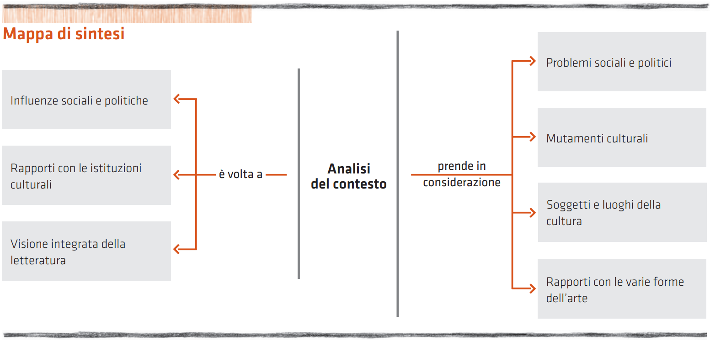

# Informazioni Propedeutiche

:::warning[Fonti]

- [LetterAutori - La letteratura delle origini](https://online.scuola.zanichelli.it/letterautori/files/2012/05/LetterAutori_Letteratura-origini.pdf)

:::

## Il contesto

:::info[Definizione]

Con contesto si indica il complesso intreccio delle circostanze e degli avvenimenti in cui si verifica un determinato fenomeno.

:::

Nel nostro caso, il fenomeno in questione è il prodotto letterario.

Il contesto include elementi *storici*, *filosofici*, *scientifici* e *artistici* che influenzano la nascita di un genere, la formazione di un autore, lo sviluppo di un'opera o l'interesse per una tematica. L'analisi del contesto, che precede lo studio letterario, permette di:

- comprendere l'influenza dell'ambiente sociale e politico sull'autore o l'opera;
- valutare i rapporti tra autori, opere e istituzioni culturali coinvolte;
- ottenere una visione integrata di un genere, autore, opera o tematica.

## Il genere letterario

:::info[Definizione]

Con genere letterario si indica un insieme di testi che presentano analogie e presuppongono criteri comuni di analisi.

:::

I generi letterari sono definiti da caratteristiche tematiche e formali comuni, che possono manifestarsi in versi o prosa, in lingua ricercata o dialettale, e variare in dimensioni.

Con il tempo, i generi sono cambiati radicalmente: alcuni sono scomparsi, altri sono emersi e altri ancora hanno evoluto aspetti innovativi rispetto alla tradizione.

### I generi letterari dell’antichità

La letteratura antica utilizzava principalmente la poesia come forma espressiva. Questa si articolava in tre principali generi:

- **Epica**: narrava le imprese degli eroi, le leggende e i miti.
- **Lirica**: cantava i sentimenti, la fantasia, gli affetti familiari, il rapporto con se stessi e con il mondo, la ricerca del significato della vita.
- **Drammatica**: scritta per essere rappresentata sulla scena; narrava o le gesta di eroi e di personaggi illustri o le
vicende della gente comune.

### I generi letterari oggi

Nel corso della storia letteraria, la rigida divisione dei generi è stata progressivamente superata per dare spazio alla libera ispirazione e creatività, non più vincolate dalle regole compositive. Oggi i generi letterari sono suddivisi in:

- **Lirica**: testi in versi che esprimono emozioni.
- **Narrativa**: testi in prosa che raccontano storie.
- **Saggistica**: testi in prosa che trattano di discipline, problemi o eventi.
- **Drammaturgia**: testi destinati alla rappresentazione teatrale.
