# Allenamento Base (GPT)

:::warning[Deprecata]

Questa routine è stata aggiornata grazie ai consigli del trainer e non viene più utilizzata. La versione aggiornata è sull'app **Hevy**.

:::

## Giorno 1: Pettorali, spalle, tricipiti

### Pettorali

1. **Panca piana con bilanciere o manubri** - 4 serie x 8-10 ripetizioni
    

        <label><input type="checkbox" id="set1" /></label>
        <label><input type="checkbox" id="set2" /></label>
        <label><input type="checkbox" id="set3" /></label>
        <label><input type="checkbox" id="set4" /></label>
    

    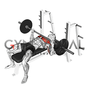
2. **Panca inclinata con manubri** - 4 serie x 8-10 ripetizioni
    

        <label><input type="checkbox" id="set1" /></label>
        <label><input type="checkbox" id="set2" /></label>
        <label><input type="checkbox" id="set3" /></label>
        <label><input type="checkbox" id="set4" /></label>
    

   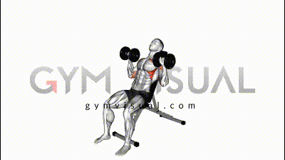
3. **Croci su panca inclinata con manubri** - 3 serie x 10-12 ripetizioni
    

        <label><input type="checkbox" id="set1" /></label>
        <label><input type="checkbox" id="set2" /></label>
        <label><input type="checkbox" id="set3" /></label>
    

### Spalle

1. **Military press con bilanciere manubri** - 4 serie x 8-10 ripetizioni
    

        <label><input type="checkbox" id="set1" /></label>
        <label><input type="checkbox" id="set2" /></label>
        <label><input type="checkbox" id="set3" /></label>
        <label><input type="checkbox" id="set4" /></label>
    

    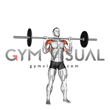
2. **Alzate laterali con manubri** - 3 serie x 12 ripetizioni
    

        <label><input type="checkbox" id="set1" /></label>
        <label><input type="checkbox" id="set2" /></label>
        <label><input type="checkbox" id="set3" /></label>
    

    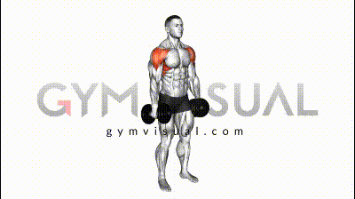
3. **Alzate frontali con manubri o bilanciere** - 3 serie x 12 ripetizioni
    

        <label><input type="checkbox" id="set1" /></label>
        <label><input type="checkbox" id="set2" /></label>
        <label><input type="checkbox" id="set3" /></label>
    

    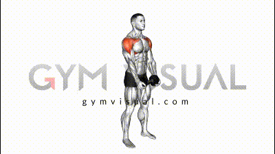

### Tricipiti

1. **French press con bilanciere EZ** - 4 serie x 10-12 ripetizioni
    

        <label><input type="checkbox" id="set1" /></label>
        <label><input type="checkbox" id="set2" /></label>
        <label><input type="checkbox" id="set3" /></label>
        <label><input type="checkbox" id="set4" /></label>
    

2. **Estensioni dietro la nuca con manubrio** - 3 serie x 10-12 ripetizioni
    

        <label><input type="checkbox" id="set1" /></label>
        <label><input type="checkbox" id="set2" /></label>
        <label><input type="checkbox" id="set3" /></label>
    

3. **Push down ai cavi** - 4 serie x 12 ripetizioni
    

        <label><input type="checkbox" id="set1" /></label>
        <label><input type="checkbox" id="set2" /></label>
        <label><input type="checkbox" id="set3" /></label>
        <label><input type="checkbox" id="set4" /></label>
    

---

## Giorno 2: Schiena, bicipiti

### Schiena

1. **Trazioni alla sbarra o lat machine** - 4 serie x 8-10 ripetizioni
    

        <label><input type="checkbox" id="set1" /></label>
        <label><input type="checkbox" id="set2" /></label>
        <label><input type="checkbox" id="set3" /></label>
        <label><input type="checkbox" id="set4" /></label>
    

2. **Rematore con manubri** - 4 serie x 8-10 ripetizioni
    

        <label><input type="checkbox" id="set1" /></label>
        <label><input type="checkbox" id="set2" /></label>
        <label><input type="checkbox" id="set3" /></label>
        <label><input type="checkbox" id="set4" /></label>
    

3. **Pulley basso** - 4 serie x 10-12 ripetizioni
    

        <label><input type="checkbox" id="set1" /></label>
        <label><input type="checkbox" id="set2" /></label>
        <label><input type="checkbox" id="set3" /></label>
        <label><input type="checkbox" id="set4" /></label>
    

4. **Lat machine presa inversa** - 3 serie x 10-12 ripetizioni
    

        <label><input type="checkbox" id="set1" /></label>
        <label><input type="checkbox" id="set2" /></label>
        <label><input type="checkbox" id="set3" /></label>
    

### Bicipiti

1. **Curl con bilanciere EZ** - 4 serie x 10-12 ripetizioni
    

        <label><input type="checkbox" id="set1" /></label>
        <label><input type="checkbox" id="set2" /></label>
        <label><input type="checkbox" id="set3" /></label>
        <label><input type="checkbox" id="set4" /></label>
    

2. **Curl alternato con manubri** - 3 serie x 10-12 ripetizioni
    

        <label><input type="checkbox" id="set1" /></label>
        <label><input type="checkbox" id="set2" /></label>
        <label><input type="checkbox" id="set3" /></label>
    

3. **Hammer curl** - 3 serie x 10-12 ripetizioni
    

        <label><input type="checkbox" id="set1" /></label>
        <label><input type="checkbox" id="set2" /></label>
        <label><input type="checkbox" id="set3" /></label>
        <label><input type="checkbox" id="set4" /></label>
    

---

## Giorno 3: Gambe, addominali

### Gambe (senza squat e stacchi)

1. **Leg press** - 4 serie x 10-12 ripetizioni
    

        <label><input type="checkbox" id="set1" /></label>
        <label><input type="checkbox" id="set2" /></label>
        <label><input type="checkbox" id="set3" /></label>
        <label><input type="checkbox" id="set4" /></label>
    

    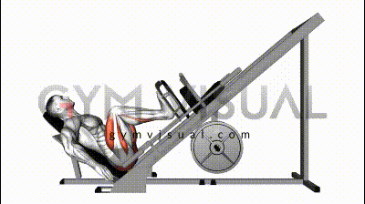
2. **Leg curl (femorali)** - 4 serie x 10-12 ripetizioni
    

        <label><input type="checkbox" id="set1" /></label>
        <label><input type="checkbox" id="set2" /></label>
        <label><input type="checkbox" id="set3" /></label>
        <label><input type="checkbox" id="set4" /></label>
    

    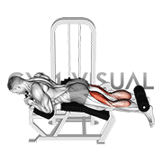
3. **Leg extension (quadricipiti)** - 4 serie x 10-12 ripetizioni
    

        <label><input type="checkbox" id="set1" /></label>
        <label><input type="checkbox" id="set2" /></label>
        <label><input type="checkbox" id="set3" /></label>
        <label><input type="checkbox" id="set4" /></label>
    

    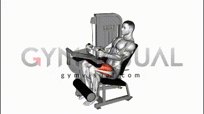
4. **Calf raises (polpacci)** - 4 serie x 15-20 ripetizioni
    

        <label><input type="checkbox" id="set1" /></label>
        <label><input type="checkbox" id="set2" /></label>
        <label><input type="checkbox" id="set3" /></label>
        <label><input type="checkbox" id="set4" /></label>
    

    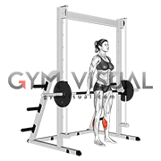

### Addominali

1. **Crunch a terra** - 3 serie x 15-20 ripetizioni
    

        <label><input type="checkbox" id="set1" /></label>
        <label><input type="checkbox" id="set2" /></label>
        <label><input type="checkbox" id="set3" /></label>
    

    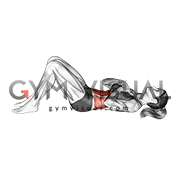
2. **Crunch inverso su panca inclinata** - 3 serie x 15-20 ripetizioni
    

        <label><input type="checkbox" id="set1" /></label>
        <label><input type="checkbox" id="set2" /></label>
        <label><input type="checkbox" id="set3" /></label>
    

    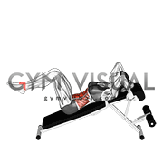
3. **Plank** - 3 serie x 30-60 secondi
    

        <label><input type="checkbox" id="set1" /></label>
        <label><input type="checkbox" id="set2" /></label>
        <label><input type="checkbox" id="set3" /></label>
    

    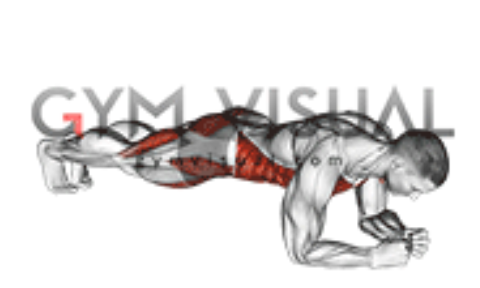
